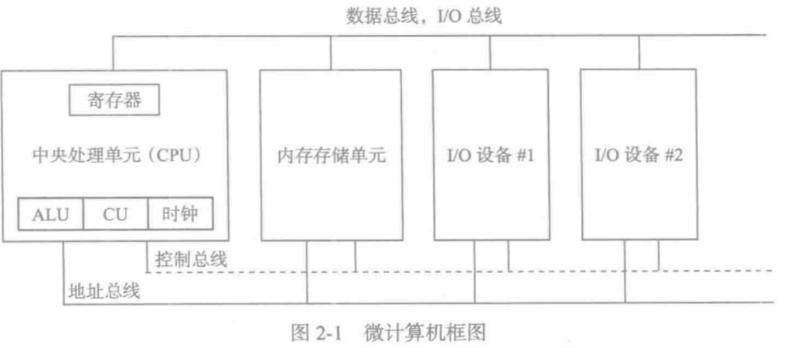
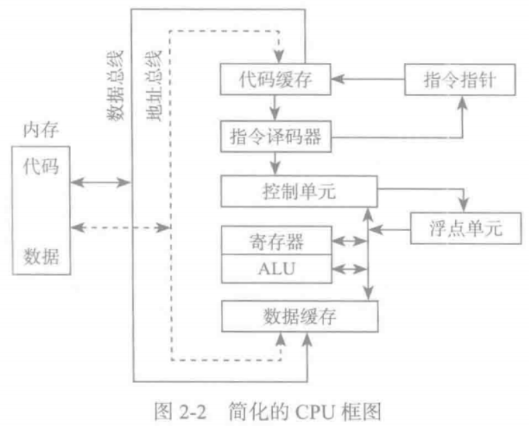
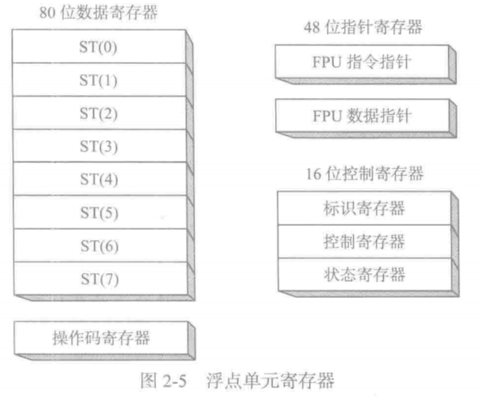
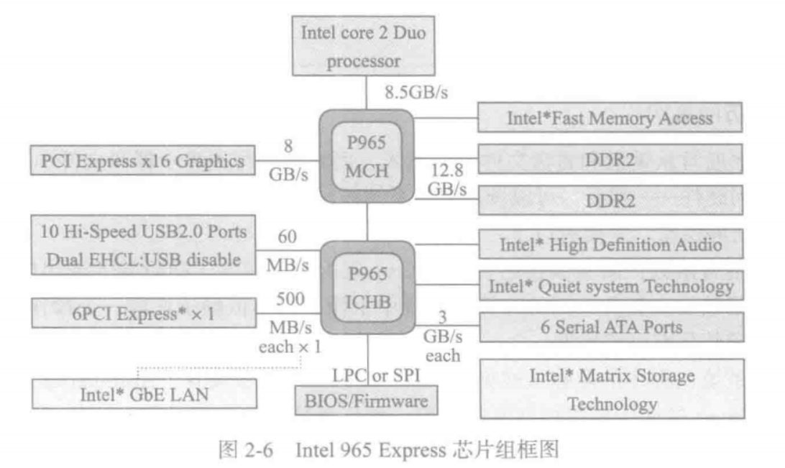

# 86处理器架构

* 首先必须熟悉处理器内部结构与功能，本章讨论指令执行时处理器内部发生的一些基本操作，以及操作系统如何加载和执行程序。

## 一般概念

### 体系结构

* 描述了X86处理器系列架构，以及从程序员角度看到的主机系统，包括了Intel IA-32和Intel 64处理器
* 中央处理器(CPU)是进行算术和逻辑操作的部件， 包含了有限数量的存储位置 - 寄存器(register), 一个高频时钟， 一个控制单元和一个算数逻辑单元
* 图解
  * 

* 控制部件
  * 时钟(clock): 对CPU内部操作与系统其他组件进行同步
  * 控制单元(control unit, CU): 协调参与机器指令执行的步骤序列
  * 算数逻辑单元(arithmetic logic unit, ALU)执行算数运算(如， 加减法， 逻辑运算， AND, OR, NOT)
  * 说明
    * CPU通过主板上的CPU插座的引脚与计算机其他部分相连， 大部分引脚连接的是数据总线，控制总线，地址总线
    * 内存存储单元(memory storage unit): 用于在程序运行时保存指令数据。 他接受来自CPU的数据请求，将数据从随机存储器(RAM)传输到CPU， 并从CPU传递数据到内存
    * 所有数据处理都在CPU进行，所以保存在内存中的程序在执行前需要被复制到CPU(程序指令被复制到CPU是，可以一次复制一条或多条)
  * 总线
    * 总线(bus)是一组并行线，用于将数据从计算机一个部分传送到另一个部分。一个计算机系统通常包含四类总线
      * 数据类(data bus): 数据总线在CPU和内存之间传输指令和数据
      * I/O类： I/O总线在CPU和系统输入/输出设备之间传输数据
      * 控制类(control bus): 控制总线用二进制信号对所有连接在系统总线上的设备的行为进行同步
      * 地址类： 当前执行指令在CPU和内存之间传输数据时，地址总线(address bus)用于保持指令和数据的地址
  * 时钟
    * 与CPU和系统总线相关的每一个操作都是由一个恒定速录的内部时钟脉冲来进行同步。
    * 机器指令的基本时间单位是机器周期(machine cycle)或时钟周期(clock cycle).（一个时钟周期的时长是一个完整时钟脉冲所需要的时间）
      * 可以记作两个相邻下降沿之间的时间。
    * 时钟周期持续时间使用时钟速度的倒数来计算，而时钟速度则用每秒震荡数来衡量。 
      * 例如一个每秒震荡10亿(1GHz)次的时钟, 时钟周期为10亿分之一秒(1纳秒)
      * 执行一条机器指令最少需要一个时钟周期，有的需要几十个。

### 指令执行周期

* CPU在执行一条机器指令时，需要经过过一系列预先定义好的步骤，这些步骤被称为指令执行周期(instruction execution cycle).

* 如果指令指针寄存器已经有了想要执行的指令的地址

  1. CPU从被称为指令队列(instruction queue)的内存区域取得指令， 之后立即增加指令指针的值
  2. CPU对指令的二进制位模式进行译码。这种位模式可能会表示该指令由操作数(输入值)
  3. 如果有操作数，CPU就从寄存器和内存中取得操作数，有时候这一步还包括了地址计算
  4. 使用步骤3得到的操作数，CPU执行该指令，同时更新部分状态标志位，如零标志位(Zero), 进位标志(Carry)和溢出标志(Overflow)
  5. 如果输出操作数也是该指令的一部分，那么CPU还需要存放其执行结构

* 通常将如上听起来很复杂的过程简化为三个步骤： 取值(Fetch), 译码(Decode) 和执行(Execute). 操作数(operand)是指操作过程中输入或者输出的值

* 图解

  * 

  * 解析
    * 该图表现了在指令执行周期中相互交互部件之间的关系。在从内存读取程序指令之前，将其地址放到地址总线上。然后内存控制器将所需代码送到数据总线上，存入代码高速缓存(code cache)
    * 指令指针的值决定下一条将要执行的指令。指令由指令译码器分析，并产生相应的数据信号送往控制单元。

### 读取内存

* 作为一个常见现象， 计算机从内存读取数据比从内部寄存器慢得多， 要从内存读取一个值要经过
  1. 将想要读取的值的地址放到地址总线上
  2. 设置处理器RD(读取)引脚(改变RD的值)
  3. 等待一个时钟周期给存储器芯片进行响应
  4. 将数据从数据总线复制到目标操作数
* 上述每一步通常只需要一个时钟周期， 时钟周期是基于处理器内固定速率时钟节拍的一种时间测量方法(计算机的CPU通常是用其时钟速率来描述的)。尽管四个时钟周期很快，但访问寄存器通常只需要一个时钟周期
* 但CPU设计者发现，绝大多数程序需要访问变量， 内存成为了主要瓶颈。所以大部分近期使用过的指令和数据存放在高速存储器cache中. （思想是，程序更希望反复访问相同的内存和指令， 所以cache保存这些值就能是他们更快被访问）
* 此外，当CPU开始执行一个程序，cache会预先将后续1000（例如）条指令加载到cache。(基于这些指令很快就会用到的假设)
  * cache中没有找到数据，称为cache未命中，反之为命中
* X86系列中cache有两种类型， 一级cache(位于CPU上)， 二级cache(次cache), 通过高速数据总线与CPU相连。
* cache存储器由一种被称为静态RAM(static RAM)的特殊存储器芯片构成，不需要为了保持内容不断刷新。但是动态RAM(dynamic RAM)需要保持刷新。速度慢些

### 加载并执行程序

* 在程序执行之前，需要用一种工具程序程序加载器(program loader), 加载后，操作系统必须将CPU指向程序入口，程序开始执行的地址
  1. 操作系统(OS)在当前磁盘目录下搜索程序的文件名，找不到在预定目录搜索文件名。当搜索不到会报错
  2. 如果程序被找到，OS就访问磁盘目录中的程序文件基本信息，包括文件大小，以及其在磁盘驱动器上的物理位置
  3. OS确定内存中下一个可使用的位置，将程序文件加载到内存。为该程序分配内存块，并将程序大小和位置信息加入表中(有时称为描述符表(descriptor table)), 另外OS可能调整程序内指针的值，使得他们包括程序数据地址
  4. OS开始执行程序的第一条机器指令(程序入口)。当程序开始执行时后， 就成为一个进程(process). OS为这个进程分配一个标识号(进程ID)， 用于在执行期间对其进行追踪。
  5. 进程自动运行。OS的工作是追踪进程的执行，并响应系统资源的请求。这些资源包括内存，磁盘文件和输入输出设备等等。
  6. 进程结束后，就会从内存中移除

## 32位X86处理器

### 操作模式

1. x86处理器由三个主要的操作模式： 
   * 保护模式: 原生模式，所有指令和特性都是可用的。
   * 实地址模式
   * 系统管理模式
   * 以及一个子模式： 虚拟8086(virtual-8086)模式(保护模式的特殊情况)
2. 说明
   1. 保护模式(Protected Mode): 保护模式是处理器的原生状态， 这种模式下，所有的指令和特性都是可用的。 分配给程序的独立内存区域被称为段， 而处理器会阻止程序使用自身段范围之外的内存。
   2. 虚拟8086模式(Virtual-8086 Mode): 保护模式下，处理器可以在一个安全的环境中，直接执行实地址模式软件，如MS-DOS
      * 如果一个程序崩溃或者试图向系统内存区域写数据，都不会影响到同一时间内执行的其他程序
      * 现代操作系统可以同时执行多个独立的虚拟8086会话
   3. 实地址模式(Real-Address Mode)
      * 实地址模式实现的是早期Intel处理器的编程环境，但是增加了一些其他特性，如切换到其他模式的功能。
   4. 系统管理模式(System Management Mode): 
      * 系统管理模式(SMM)向操作系统提供了实现诸如电源管理和系统安全等功能的机制。

### 基本执行环境

1. 地址空间
   * 在32位保护模式下，一个任务或者程序最大可以寻址4GB的线性地址空间。 但从P6处理器开始，一种称为拓展物理寻址(extended physical addressing)的技术可以使得被寻址的物理内存空间增加到64G
   * 但是实地址模式程序只能寻址1MB空间， 如果处理器在保护模式下运行多个虚拟8086程序，则每个程序只能拥有自己的1MB内存空间。
2. 通用寄存器
   1. 32位通用寄存器
      1. EAX
      2. EBX
      3. ECX
      4. EDX
      5. EBP
      6. ESP
      7. ESI
      8. EDI
   2. 其他寄存器
      1. EFLAGS (处理器状态标志寄存器)
      2. EIP (指令指针寄存器)
   3. 16位段寄存器
      1. CS
      2. SS
      3. DS
      4. ES
      5. FS
      6. GS
3. 基本程序执行寄存器
   * 寄存器是直接位于CPU内的高速存储位置，其设计访问速度远远高于传统存储器。(例如： 当一个循环处理为了速度进行优化时，其循环计数会保留在寄存器中而不是变量中。)
4. 寄存器说明
   1. 通用寄存器： 通用寄存器主要用于算术运算和数据传输
      * 32位EAX寄存器的低16位在使用时可以使用AX表示
      * 一些寄存器的组成部分可以处理8位的值，例如AX寄存器的高8位可以被称为AH， 而低8位被称为AL
      * EAX， EBX， ECX， EDX等寄存器都可以这样使用
   2. 其他通用寄存器只能使用32位或16位名称来访问
      1. 32位: `ESI, EDI, EBP, ESP`
      2. 16位: `SI, DI, BP, SP`
   3. 特殊用法： 默认通用寄存器有特殊用法： 
      * 乘除指令默认使用EAX， 他常常被称为拓展累加器(extended accumulator)寄存器。
      * CPU默认使用ECX为循环计数器，
      * ESP默认用于寻址堆栈(一种系统内部结构)， 他极少用于一般算数运算和数据传输，通常被称为拓展堆栈指针(extended stack pointer)寄存器
      * ESI和EDI用于高速存储器传输指令，有时也被称为拓展源变址(extended source index)寄存器和拓展目的编址(extended destination index)寄存器
      * 高级语言通过EBP来引用堆栈中的函数参数和局部变量，除了高级编程，他一般不用于一般的算术运算和数据传输。常常被称为拓展帧指针(extended frame pointer)寄存器
   4. 段寄存器
      1. 实地址模式下，16位段寄存器表示的是预先分配的内存区域的基址,这个内存区域称为段
      2. 保护模式中，段寄存器中存放的是段描述符表指针。
         1. 一些段中存放程序指令(代码)
         2. 其他段存放变量(数据)
         3. 还有一个堆栈段存放的是局部函数变量和函数参数
   5. 指令指针
      * 指令指针(EIP)寄存器中包含下一条将要执行指令的地址，某些机器指令能控制EIP， 使得程序分支转向到一个新位置
   6. EFLAGS寄存器
      * EFLAGS(或Flags)寄存器包含了独立的二进制位，用于控制CPU的操作，或是反映一些CPU操作的结果。有些指令可以测试和控制这些单独的处理器标志位。
      * 设置标志位，该标志位为1， 清除(或重置)标志位，该标志位为0
   7. 控制标志位
      * 控制标志位控制CPU的操作。
        * 例如他们能使得CPU每执行一条指令后进行中断
        * 在侦测到算术运算溢出时中断执行，
        * 进入虚拟8086模式，以及进入保护模式
      * 程序能够通过设置EFLAGS寄存器中的单独位来控制CPU的操作，比如，方向标志位和中断标志位。
   8. 状态标志位
      * 状态标志位反映了CPU执行的算术和逻辑操作的结果。其中包括： 溢出位，符号位，零标志位，辅助进位标志位，奇偶校验位和进位标志位
        * 进位标志位(CF), 与目标位置相比，无符号算术运算结果太大时，设置该标志位
        * 溢出标志位(OF)， 与目标位置相比，有符号算术运算结果太大或太小时，设置该标志位
        * 符号标志位(SF), 算术或逻辑操作产生负结果时，设置该标志位
        * 零标志位(ZF), 算术或逻辑操作产生结果位零时，设置该标志位
        * 辅助进位标志位(AC), 算术操作在8位操作数中产生了位3向位四的进位时，设置该标志位
        * 奇偶校验标志位(PF), 结果的最低有效字节包含偶数个1时，设置该标志位，否则，清除该标志位
5. MMX寄存器
   * 在实现高级多媒体和通信应用时，MMX技术提供了Intel处理器的性能，8个64位MMX寄存器支持称为SIMD(单指令，多数据， Single-Instruction, Multiple-Data)的特殊指令
   * MMX指令对于MMX寄存器中的数据值进行并行操作， 虽然看上去是独立的寄存器，但是MMX寄存器实际上是浮点单元中使用的同样寄存器的别名
6. XMM寄存器
   * x86还包括8个128位XMM寄存器，用于SIMD流拓展指令集
   * 浮点单元: 浮点单元(FPU, floating-point unit)执行高速浮点算术运算。之前浮点运算需要一个独立的协处理器，从Intel486处理器开始，FPU已经集成到主处理器上。 
   * FPU中有8个浮点数据寄存器， 分别命名为ST(0)~ST(7)
   * 其他寄存器
     * 

### X86内存管理

* 前面讨论过内存访问模式，保护模式是最可靠的，最强大的，但是他对应用程序直接访问系统硬件有着严格的限制
* 实地址模式中，只能寻址1MB内存，从00000H 到 FFFFFH, 处理器一次只能运行一个程序，但是可以暂时中断程序来处理来自外围设备的请求(中断)
* 在保护模式下，处理器可以同时运行多个程序，他为每个进程分配共4GB内存，每个程序都分配有自己的保留内存区域， 程序之间禁止意外访问其他程序的代码和数据
* 在虚拟8086模式中，计算机运行在保护模式下，通过创建一个带有1MB地址空间的虚拟8086机器来模拟运行于实地址模式的8086计算机。

## 64位X86_64处理器

* 关注64位处理器， intel 64和AMD64处理器系列， 指令集是以讨论过的X86指令集的64位拓展
  1. 向后兼容X86指令集
  2. 地址长度位64位， 虚拟地址空间位2^64字节。按照当前芯片的实际情况，只能使用地址的低48位
  3. 可以使用64位通用寄存器，允许指令具有64位整数操作数
  4. 比x86多了8个通用寄存器
  5. 物理地址位48位， 支持高达256TB的RAM
* 当处理器运行于本机64位模式时，是不支持16位实模式或者虚拟8086模式的
  * 尽管x86-64指的是指令集，但是也可以将其看作是处理器类型。

### 64位操作模式

* Intel64架构引入了新模式，称为IA-32e.  从技术来说，这个模式包含两个子模式
  * 兼容模式(compatibility mode): 在兼容模式下，现有16位和32位应用程序通常不需要编译就可以运行
    * 但是16位Windows和DOS应用不能运行在64Microsoft Windows下
    * 与早期版本不同，64位Windows没有虚拟DOS机器子系统来利用处理器的功能切换到虚拟8086模式
  * 64位模式(64-bit mode)
    * 在64位模式下，处理器执行的是使用64位线性地址空间的应用程序。这是64位Microsoft Windows的原生模式，该模式能过够使用64位指令操作数

### 基本64位执行环境

1. 64位模式下，虽然处理器现在只能支持48位地址，但是理论上最大地址位64位。
2. 与32位最主要的区别
   1. 16个64位通用寄存器(32位只有8个通用寄存器)
   2. 8个80位浮点寄存器
   3. 1个64位状态标志寄存器RFLAGS(只使用低32位)
   4. 1个64位指针寄存器RIP
   5. 用于多媒体处理器的特殊寄存器
      1. 8个64位MMX寄存器
      2. 16个128位XMM寄存器(32位模式下只有8个XMM寄存器)
   6. 64位模式下，默认操作数大小是32位，并且有8个通用寄存器但是，给每条指令加上REX前缀后，操作数可以到达64. 
      * 但是，给每条指令加上REX前缀后，操作数可以到达64. 
3. 64位可用寄存器
   1. 8位: `AL, BL, CL, DL, DIL, SIL, BPL, SPL, R8L, R9L, R10L, R11L, R12L, R13L, R14L, R15L`
   2. 16位: `AX, BX, CD, DX, DI, SI, BP, SP, R8W, R9W, R10W, R11W, R12W, R13W, R14W, R15W`
   3. 32位: `EAX, EBX, ECX, EDX, ESI, EDI, EBP, ESP, R8D, R9D, R10D, R11D, R12D, R13D, R14D, R15D`
   4. 64位: `RAX, RBX, RCX, RDX, RDI, RSI, RBP, RSP, R8, R9, R10, R11, R12, R13, R14, R15`
4. 注意:
   1. 64位模式下，单条指令不能同时访问寄存器高字节，如AH, BH, CD,和DH， 以及新字节寄存器的低字节(DIL)
   2. 64位模式下，32位EFLAGS寄存器由64位RFLAGS寄存器取代。这两个寄存器共享低32位，而RFLAGS的高32位不使用
   3. 32位和64位模式具有相同的状态标志

## 典型X86计算机组件

### 主板

* 主板是微型计算机的心脏，他是一个平面电路板，上面集成了CPU， 支持处理器(芯片组(chipset)), 主存， 输入输出接口，电源接口，拓展插槽。各种组件通过总线即一组直接蚀刻在主板上的导线连接。
* 主板一般包含如下部件
  * CPU插座： 插座由不同的形状和尺寸
  * 存储器插槽(SIMM或DIMM): 用于直接插入小型内存条
  * BIOS(基本输入输出系统, basic input-output system)计算机芯片，保存系统软件
  * CMOS RAM: 用一个小型纽扣电池为其供电
  * 大容量插槽设备接口， 如硬盘和CD-ROMS
  * 外部设备的USB接口
  * 键盘和鼠标的接口
  * PCI总线接口，用于声卡，显卡，数据采集卡和其他输入输出设备
* 可选组件
  * 集成声音的处理器
  * 并行和串行设备接口
  * 集成网卡
  * 用于高速显卡的AGP总线接口
* 典型系统中重要的支持处理器
  * 浮点电源(FPU): 处理浮点数和拓展整数运算
  * 8284/82C84时钟发生器，时钟发生器同步CPU和计算机其他部分
  * 8259A 可编程中断控制器(PIC, Programmable Interrupt Controller), 处理来自硬件设备的外部中断请求，包括键盘，系统时钟，磁盘驱动器
  * 8253可编程间隔定时器/计数器(Programmable Interval Timer/Counter), 每秒中断系统18.2次 ， 更新系统日期和时钟，并控制扬声器， 还负责不断地刷新内存，因为RAM存储器芯片保持内容时间只有几毫秒
  * 8255可编程并行端口(Programmable Parallel Port), 使用IEEE并行端口将数据输入和输出计算机，通常用于打印机。

### PCI和PCI Express总线架构

* PCI(外部设备互联， Peripheral Component Interconnect), 总线为CPU和其他系统设备提供了连接桥， 这些设备包括硬盘，内存，显卡，声卡，网卡。
* 最近PCI Express总线在设备，内存和处理器之间提供了双向串行连接，它采用独立的通道传送数据包，该总线得到显卡的广泛支持。

### 主板芯片组

* 是一组处理器芯片的集合，这些芯片被设计为在特定类型主板上一起工作。各种芯片组具有增强处理器能力，多媒体功能或减少功耗等特性。
* 例如Intel P965 Express芯片组具有如下特性
  * Intel高速内存访问(Fast Memory Access)使用了最新内存控制中心(MCH), 
  * I/O控制中心(Intel ICH8/R/DH)使用了Intel矩阵存储技术来支持多个串行ATA设备(磁盘驱动器)
  * 支持多个USB端口，多个PCI Express插槽，联网和intel静音技术
* 

### 内存

* 基于Intel的心痛使用的是集中基础类型内存
  * 只读存储器(ROM): 永久烧录在芯片上，并且不能擦除
  * 可擦除可编程只读存储器(EPROM)： 能用紫外线缓慢擦除，并重新编程
  * 动态随机访问存储器(DRAM): 内存，价格便宜，但是每秒刷新
  * 静态RAM(SRAM)： 速度快，不需要刷新
  * 图像随机存储器(VRAM)： 保存视频数据，VRAM是双端口的，允许一个端口持续刷新显示器，同时另一个端口将数据写到显示器
  * CMOS RAM在系统主板上，保存系统设置的信息，由电池供电

## IO访问层次

* 应用程序通常从键盘或者磁盘文件读取输出，将输出写道显示屏和文件中，完成IO不需要直接访问硬件，可以调用操作系统的函数
* IO也有不同访问层次，主要三个
  1. 高级语言： C++, Java, 不依赖于任何一个操作系统，具有可移植性
  2. 操作系统： 程序员能够从API的库中调用操作系统函数，
  3. BIOS： 基本输入输出系统是一组能够直接于硬件设备通信的低级子程序集合。BIOS由计算机制造商安装并定制，以适应机器硬件。
* 设备驱动成程序： 设备驱动程序允许操作系统于硬件设备和系统BIOS直接通信，
* 应用程序显示字符串过程
  1. 应用程序调用HLL库函数，将字符串写入标准输出
  2. 库函数(第三层)调用操作系统函数，传递一个字符串指针
  3. 操作系统(第二层)用循环的方法调用BIOS子程序， 向其传递每个字符的ASCII码和颜色。 操作系统调用另一个BIOS子程序，将光标启动到屏幕下一行
  4. BIOS子程序(第一层)接受一个字符，将其映射到一个特定的系统字体，并把该字符发送到于视频控制卡相连的硬件端口
  5. 视频控制卡(第0层)为视频显示产生定时硬件信号，来控制光栅扫描并显示像素
* 汇编语言的多层次IO编程
  1. 第三层： 调用库函数来执行通用文本I/O和基于文件的I/O
  2. 第二层： 调用操作系统函数来执行通用文本I/O和基于文件的I/O
  3. 第一层： 调用BIOS函数来控制设备具体特性，如颜色，图形，生硬，键盘输入和底层磁盘I/O
  4. 第0层： 从硬件端口发送和接受数据，对特定设备具有绝对控制权。不具有可移植性。
     * 不同设备通常使用不同的硬件端口，所以程序代码必须根据每个设备的特定类型来进行定制
* 要在那个层次?
  * 假设用音频控制设备来播放一个WAV文件，在OS层面，不需要了解已安装设备的类型，也不用关心设备卡的非标准特性。
  * 在BIOS层面，要查询声卡(通过已经安装的驱动程序)，找出是否属于某一类已知功能的声卡。
  * 在硬件层面，需要对特定模式声卡的程序进行微调，以利用声卡特性。