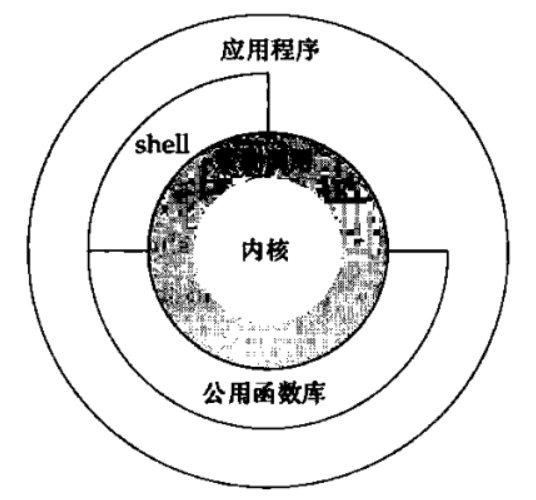

# 基础知识

## 引言

* 所有操作系统都为他们所运行的程序提供服务。典型的服务包括： 执行新程序，打开文件，读取文件，分配存储区以及获取当前时间。

## UNIX体系结构

* 严格意义上，可以将操作系统定义为一种软件，他控制计算机硬件资源，提供程序运行环境。通常称之为内核。

  * 

  * 内核的接口成为系统调用(system call),
    * 公用函数库构建在系统调用接口上，
    * 应用程序既可以使用公用函数，也可以使用系统调用。
    * shell是一个特殊应用，为运行其他应用程序提供了一个接口
  * 一个操作 系统
    * 内核
    * 其他软件： 系统实用程序(system utility),应用程序，shell和公用函数库

## 登录

1. 登录名
   * 键入用户名，口令，系统校验(/etc/passwd)然后登录
     * 该文件登陆项由7个以冒号分割的字段组成，依次是
       * 登录名
       * 加密口令
       * 数字用户id
       * 数字组id
       * 注释字段
       * 起始目录
       * shell程序  
2. shell
   * 登陆后，系统它通常显示系统信息，然后用户就可以向shell程序键入命令。
   * 有些系统启动一个视窗管理程序，但最终最会有一个shell程序运行在一个视窗中。

## 文件和目录

1. 文件系统

   * Unix文件系统是目录和文件的一种层次结构，所有东西的起点称之为根(root)
   * 目录(directory)是一个包含目录项的文件。逻辑上，可以认为目录就是维护了文件名和文件inode的列表。
     * `stat`, `fstat`函数。

2. 文件名

   * 目录中的各个名字称之为文件名(filename), 只有斜线(/)和空字符不能出现在文件名，但是为了可移植，尽量使用标识符规则
   * POSIX规范推荐文件名限制在: 字母(a~z, A~Z), 数字， 句点短横线，下划线
   * 创建目录会自动创建两个文件名，`.`和`..`

3. 路径名

   * 由斜线分割的一个或者多个文件名组成的序列，绝对路径或者相对路径

4. 列出一个目录中的所有文件名字

   ```c
   #include "apue.h"		// 公共头文件
   #include "dirent.h"		// 系统头文件定义opendir, readdir, dirent
   
   int main(int argc, char *argv[])
   {
       DIR					*dp;
       struct dirent		* dirp;
       
       if (argc != 2)
           err_quit("usage: ls directory_name");
       if((dp = opendir(argv[1])) == NULL)
           err_sys("can't open %s", argv[1]);
       
       while((dirp = readdir(dp)) != NULL){
           printf("%s \n", dirp->d_name);
       }
       
       closedir(dp);
       exit(0);
   }
   ```

5. 查看手册

   * `man 1 ls`
   * `man -s1 ls`
   
6. 声明

   1. opendir函数返回指向DIR结构的指针，我们将该指针传递给readdir函数。不必关心DIR结构返回什么，然后在循环中调用readdir来读取每一个目录项。他返回一个指向dirent结构的指针，当目录中无目录项时返回NULL指针。
   2. 目前程序调用了两个自编函数对于错误进行处理，`err_sys`, `err_quit`.

7. 工作目录

   * 每一个进程都有一个工作目录(working directory), 有时候称之为当前工作目录(current working directory).所有的相对路径名都从工作目录开始解释。进程可以使用`chdir`函数更改其工作目录。

8. 起始目录

   * 登录时，工作目录设置为起始目录(home directory), 起始目录从口令文件中相应用户的登录项目中取得。

## 输入和输出

1. 文件描述符

   * 文件描述符(file descriptor)通常是一个小的非负整数，内核用以标识一个特定进程正在访问的文件。当内核打开一个现有文件或者创建一个新文件时，他都返回一个文件描述符。(读写文件时，可以使用)

2. 标准输入，标准输出和标准错误输出

   1. 管理来说，每当运行一个新的程序，所有的shell都为其打开3个文件描述符，标准输入(standard input), 标准输出(standard output)以及标准错误输出(standard error)
      * 如果不做特殊处理，这三个描述符都链接向终端
   2. 可以使用输入输出重定向

3. 不带缓冲的io

   * 函数open, read, write, lseek, close, 提供了不带缓冲的i/o.

   * 如下函数实现，复制任意一unix普通文件

     ```c
     #include "apue.h"
     
     #define BUFFSIZE 4096
     
     int main(void) {
     
         int n;
         char buf[BUFFSIZE];
     
         // read返回读取的字节数，到达文件结尾，read返回0
         // read函数出错时返回-1， 大多数系统函数出错返回-1
         while ((n = read(STDIN_FILENO, buf, BUFFSIZE)) > 0)  
             if (write(STDOUT_FILENO, buf, n) != n)
                 err_sys("write error");
     
         if (n < 0)
             err_sys("read error");
     
         exit(0);
     
     }
     ```

   * 头文件`<unistd.h>`以及两个常量`STDIN_FILENO`和`STDOUT_FILENO`时posix标准的一部分
     * unistd.h包含了很多UNIX系统服务的函数原型，例如read和write

4. 标准io

   1. 标准i/o函数为那些不带缓冲的i/o函数提供了一个带缓冲的接口。使用标准I/O函数无需担心如何选取最佳的缓冲区大小(如BUFFSIZE大小)，

   2. 使用标准函数还可以简化对于输入行的处理，例如可以使用fgets函数读取一个完整的行， 而read函数读取指定字节数

      ```c
      int main(void) {
          int c;
          while ((c = getc(stdin)) != EOF)
              if (putc(c, stdout) == EOF)
                  err_sys("output error!!");
      
          if (ferror(stdin))
              err_sys("input error!");
      
          exit(0);
      }
      ```

## 程序和进程

1. 程序(program)是一个存储在磁盘上某个目录中的可执行文件。内核使用exec函数(7个exec函数之一)，将程序读入内存，并执行函数。

2. 进程和进程ID

   1. 程序的执行实例被称为进程(process), 某些系统使用任务(task)表示正在执行的程序

      * unix系统确保每一个进程都有一个唯一的数字标识符，称为进程ID(process ID)

   2. 程序id获取

      ```c
      #include <stdio.h>
      #include <stdlib.h>
      #include <unistd.h>
      #include <sys/types.h>
      
      int main() {
          size_t  x = 0;
          printf("Hello World from process ID %ld\n", (long)getpid());
          exit(0);
      }
      ```

3. 进程控制

   * 有3个用于进程控制的主要函数: `fork`, `exec`(exec函数有七种变体，统称为exec), `waitpid`

   * 实例

     ```c
     int main() {
         char buf[MAXLINE];
         pid_t pid;
         int status;
     
         printf("%% ");
         // 标准函数fgets从标准输入一次读取一行，当键入文件结束符(ctrl + d)作为行第一个字符时，fgets返回一个null指针，于是循环停止，进程也就终止
         while (fgets(buf, MAXLINE, stdin) != NULL) {
             // fgets返回的每一行都以换行符终止，后面跟随一个null字节，所以使用strlen计算字符串长度，然后使用null替换换行符，(因为execlp函数要求参数是以null结束的)
             if (buf[strlen(buf) - 1] == '\n')
                 buf[strlen(buf) - 1] = 0;
             // fork创建新进程，新进程时调用进程的一个副本，fork对于父进程返回新的子进程ID, 对于子进程返回0，
             // fork创建一个新进程，所以说他被调用一次(由父进程)，但是会返回两次，分别位于父进程和子进程中
             if ((pid = fork()) < 0) {
                 err_sys("fork error");
             } else if (pid == 0) { // child
                 // 子进程中，调用execlp用以执行从标准输入读入的命令，这就用新的程序文件替换了子进程原先执行的程序文件
                 // fork和随后的exec两者组合就是某些操作系统所称的产生(spawn)一个新进程
                 execlp(buf, buf, (char *)0);
                 err_ret("couldn't execute: %s", buf);
                 exit(127);
             }
     
             // parent
             // 子进程调用execlp执行新程序文件，但是父进程希望等待子进程终止，这是通过调用waitpid实现的，其参数执行要等待的进程(即pid参数是子进程ID)
             // waitpid函数返回子进程的终止状态(status)，我们可以使用此值知道子进程如何终止
             // 目前不能向所执行命令传递参数。如要传递参数需要把参数用空格或制表分开，将分割后的参数传递给execlp函数
             if ((pid = waitpid(pid, &status, 0)) < 0)
                 err_sys("waitpid error");
             printf("%% ");
         }
     }
     ```

   4. 线程模型
      * 通常一个进程只有一个控制线程(thread),但有时多线程分别作用于多部分，解决问题方便
      * 一个进程内线程共享同一地址空间，文件描述符，栈以及与进程相关的属性。他们能够访问同一存储区，所以各个线程访问共享数据要采取同步措施
      * 线程也用id标识，但是线程只在所属进程内起作用。

## 出错处理

1. 当unix系统函数出错时，通常会返回一个负数，而整形变量errno通常被设置为具有特定信息的值
   * 例如open函数如果成功执行会返回一个非负数文件描述符，如果出错会返回-1， 当open出错时，大约有15种不同的errno值(文件不存在，权限问题)
   * 有些函数出错会返回null指针。
2. 文件`errno.h`定义了errno以及可以赋值给他的各种常量，这种常量都已字符E开头。若errno等于常量EACCES标识权限问题
3. POSIX和ISO C将errno定义为一个符合，他拓展成一个可修改的整形左值(lvalue). 
   * 它可以是一个包含出错编号的整数
     * `extern int errno;`
   * 也可以是一个返回出错编号指针的函数
     * `extern int * __errno_location(void);`
     * `#define errno (*__errno_location())`
4. 对于errno应当注意两条规则
   1. 如果没有出错，其值不会被例程清除，因为仅当函数的返回值指明出错时，才校验其值
   2. 任何函数都不会将errno值设置为0，而且在`<errno.h>`种定义的所有常量都不为0

