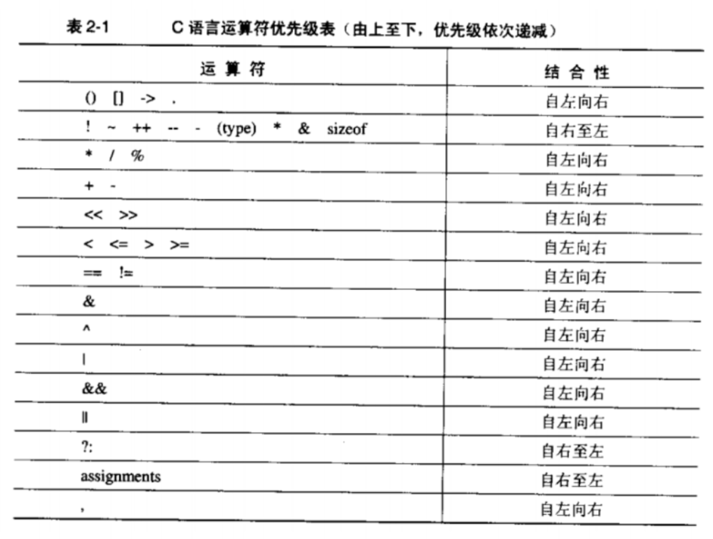

# 语法陷阱

## 说明

* 理解一个C程序，仅仅理解组成程序的符号还不够，必须理解这些符号如何组成声明，表达式，语句和程序。

## 理解函数声明

1. 调用0地址程序
   * `(*(void(*)()0))();`
2. 任何C变量的声明都由两部分组成
   1. 类型
   2. 以及一组类似表达式的声明
3. 声明 
   1. `float ((f));`
   2. `float ff();`
   3. `float *pf`
   4. `float *g(), (*h)();`
4. 如果知道了如何声明一个给定类型的变量，那么该类型的类型转换符
   1. 就是需要把声明中的标识符和结尾分号去掉
   2. 再将剩余部分使用一个括号封装起来
5. signal函数声明
   * `void (*signal(int, void (*)(int))) (int);`
   * 等价于
     * `typedef void (*HANDLER)(int);`
     * `HANDLER signal(int, HANDLER);`

## 运算符优先级问题

1. 图解
   * 