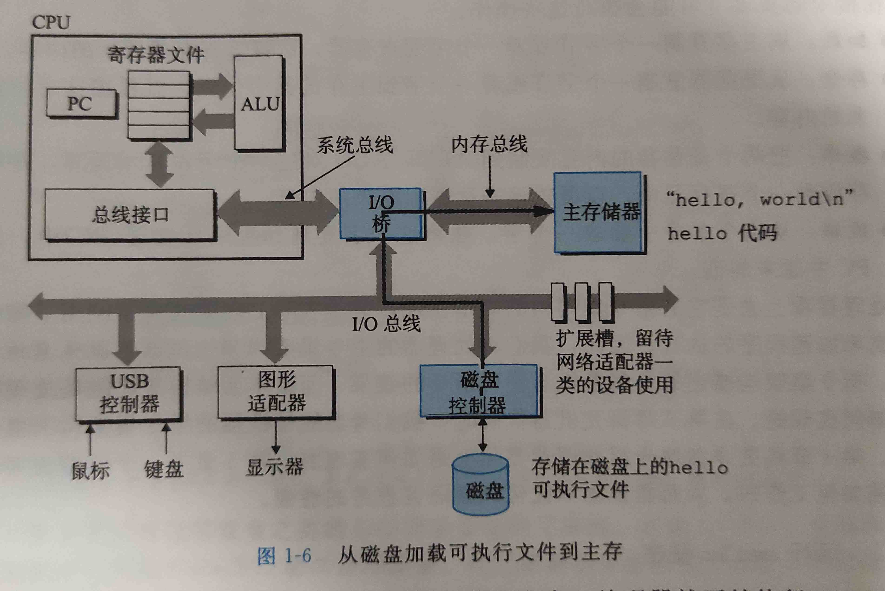

# 计算机系统漫游

  ## 信息就是位+上下文

1. Hello程序的生命周期是从一个源程序开始的，源程序实际上就是一个由值0和1组成的位序列，8位被组织成一组(称之为字节)
2. 大部分现代计算机系统都是用ASCII标准表示文本字符(就是使用单字节大小的整数值来表示每个字符)
3. hello.c程序是以字节顺序的方式存储在文件中的，每个字节对应一个整数值。对应某些字符。(这种ASCII字符组成的文件称为文本文件，所有其他文件都成为二进制文件)
4. 系统中的所有信息--(磁盘文件，内存中的程序，内存中存放的用户数据以及网络中的数据)，都是一串比特表示的。***区分不同的数据对象的唯一方法是我们读到这些数据对象时的上下文*** 不同的上下文，一个同样的字节序列可能是一个整数，浮点数，字符串或者机器指令
5. 我们必须了解数字的机器表示，他们与实际的整数和实数是不同的(他们是真值的有限近似值)
   * C语言: Dennis Ritchie, 1969~1973， American National Standards Institute(ANSI) 89年颁布ANSI C标准， 以后交由国际化标准组织(ISO) , 定义了C语言和一系列函数库

## 程序被其他程序翻译成不同的格式

1. hello程序的生命周期是从一个高级的C语言开始的，这种形式能够被人读懂。但为了能够在机器上执行，每条C指令都必须转换为一系列对应的机器指令。然后这些指令按照一种称为可执行目标程序的格式打包好，然后以二进制磁盘文件的形式存放起来。
2. 在Unix中，从源文件到目标文件的转换由编译器驱动程序完成
   1. hello.c -> 预处理器(cpp) -> hello.i
   2. hello.i -> 编译器(ccl) -> hello.s
   3. hello.s -> 汇编器(as) -> hello.o
   4. hello.o -> 链接器(ld) -> hello
3. 各阶段说明
   1. 预处理阶段： cpp根据以字符#开头的命令，修改原始C程序，得到预处理后的文件
   2. 编译阶段: 将文本文件hello.i翻译成汇编文本文件hello.s
   3. 汇编阶段：汇编器将hello.s翻译成机器语言指令，并把这些指令打包成一种叫做可重定位目标程序(relocatable object program)的格式。
   4. 链接阶段： hello程序调用了printf函数，这是c标准库中提供的函数。printf函数存在于一个名为printf.o的单独的编译好了的printf.o文件中。而链接器就负责加载这个文件合并到hello.o程序中。
4. 了解编译系统的作用
   1. 优化程序性能
   2. 理解链接时出现的错误
   3. 避免安全漏洞

## 处理器读并解释存储在内存中的指令

### 如何执行程序

* hello.c已经被编译为hello可执行文件，并放在磁盘中，可以将他的文件名输入到称为shell的应用程序中，
* shell是一个命令行解释器，输入一个命令，如果该命令不是shell内置命令，那么shell就会假设这是个可执行文件的名字

### 系统的硬件组成

1. 图解
   * 
2. 组件解析
   1. 总线
      * 总线式贯穿整个系统的一组电子管道，他携带信息字节并且负责在各个部件间传递，通常总线被设计成传送定长的字节块，也就是字(字中的字节数式一个基本的系统参数)
      * 现今多数32或64位
   2. IO设备
      * IO 输入输出，设备是系统与外部世界的联系通道。(例如： 键盘，鼠标，显示器，磁盘驱动器)
      * 每一个IO设备通过一个控制器或者适配器与I/O总线相连。
      * 控制器和适配器之间的主要区别在于他们的封装方式，功能都是在IO总线和IO设备之间传递信息。
        * 控制器是IO设备本身或者系统主板上的芯片组
        * 适配器则是一块插在主板插槽上的卡
   3. 主存
      * 主存是一个临时存储设备，执行程序时，用于存放程序和程序处理的数据。物理组成上来说，主存是由一组动态随机存取存储器(DRAM)芯片组成。
      * 逻辑上来说，存储器是一个线性的字节数组，每个字节都有其唯一的索引(从0开始)
   4. 处理器
      * 中央处理器(CPU), 又称之为处理器，是解释或者执行存储在主存中指令的引擎。处理器的核心是一个大小位一个字的存储设备(或者寄存器)，称之为程序计数器(PC). 任何时候，PC都指向下一条即将执行的指令的地址
      * 指令执行模型由指令集架构决定，在这个模型中，指令按照严格的顺序执行，执行一条指令包含执行一系列的步骤。
        * 处理器从程序计数器执行的内存读取指令，解释指令中的位，执行该指令指示的简单操作，然后更新PC，使其指向下一条指令。
      * 对于简单操作来说，他们围绕着主存，寄存器文件(register file)和算术/逻辑单元(ALU)进行
        * CPU在指令要求下可能会执行如下操作
          1. 加载: 从主存复制一个字节或者一个字到存储器，以覆盖寄存器原来的内容
          2. 存储: 从寄存器复制一个字节或者一个字到主存中的某个位置，以覆盖这个位置原来的内容
          3. 操作: 把两个寄存器的内容复制到ALU, ALU进行算术运算，并将结果存放到一个寄存器
          4. 跳转: 从指令本身抽取一个字，并将这个字复制到程序计数器(PC), 以覆盖原本内容
3. 两个概念
   1. 处理器的指令集架构看起来很简单，但是实际上现代处理器使用了非常复杂的机制来加速程序的执行
   2. 处理器的指令集架构: 描述每条机器代码指令的效果
   3. 处理器的微体系结构: 描述处理器实际上是如何实现的

### 运行hello程序

1. 整体流程描述

2. 具体描述

   1. 初始时，shell程序执行他的指令，等待我们输入一个命令，我们在键盘输入字符串，shell逐字符读取寄存器，再把它放到内存中
      * 
   2. 当我们在键盘输入回车，shell程序知道我们已经结束了命令输入，然后shell执行一系列指令来加载可执行hello文件，这些指令将hello目标文件中的代码和数据从磁盘复制到主存(数据包括字符串"helloworld"). (利用DMA，数据可以不通过处理器直接从磁盘到达主存)
      * 

   3. 一旦目标文件hello中的代码和数据被加载到主存，处理器就可以执行hello程序的main程序中的机器语言指令。是将hello字符串从主存复制到寄存器，在复制到显示设备，最终显示到屏幕上
      * 

## 高速缓存至关重要

* 一个至关重要的问题，系统花费了大量的时间把信息从一个地方挪到了另一个地方。
  * hello程序最初存放在磁盘上，加载时，加载到磁盘，当程序运行时，指令又从主存复制到处理器。
* 一个典型的系统上的磁盘驱动器可能比主存大1000倍，但是处理器从磁盘读取一个字的时间要比从主存慢100倍
* 利用高速缓存的局部性原理，即程序具有访问局部区域里的数据和代码的趋势。通过高速缓存存放经常访问的数据，大部分的内存操作都能在快速的高速缓存中完成。

## 存储器形成层次结构

1. 在处理器和一个较大较慢的设备之间插入一个更小更快的设备已经变成了普遍观念。
2. 这个体系中，从上至下，设备越来越慢，容量越大
3. 图解
   * 

## 操作系统管理硬件

1. 当shell加载运行程序时，和hello程序输出消息时， shell和hello都没有直接访问键盘，显示屏，取而代之的时依靠操作系统提供的服务。
2. 操作系统有两个基本功能
   1. 防止硬件被失控的应用乱用
   2. 向应用程序提供简单一致的机制来控制复杂而又大不相同的硬件设备
3. 操作系统通过几个基本概念(进程，虚拟内存，和文件来实现这几个功能)
   1. 文件是对I/O设备的抽象表示
   2. 虚拟内存是对主存和磁盘I/O的抽象表示
   3. 进程则是对处理器，主存和I/O的抽象表示

### 进程

1. 像hello这样的程序运行，操作系统会提供一种假象，好像只有这一个程序在运行，程序像是独立占用CPU, 内存，IO，这些假象通过进程概念实现
2. 进程是操作系统对于一个正在运行的程序的抽象，现代系统中，一个CPU看上去都像是在并发的执行多个进程，这是通过CPU进程间切换实现的。操作系统实现这种交错执行的机制，我们称之为上下文切换。(先讨论一个CPU的概念)
3. 操作系统保持跟踪进程运行所需要的所有状态信息。这种状态就是上下文。
   1. PC和寄存器其文件的当前值
   2. 主存的内容
4. 在任何一个时刻，单核cpu只有一个进程在执行，当操作系统决定把控制权从当前进程转移到某一个新进程，就会进行上下文切换
   * 上下文切换： 保存当前进程上下文，恢复新进程上下文，然后将控制权传递到新进程，新进程就会从上次停止处继续执行。

### 线程

* 通常一个进程只有一个单一的控制流，但是现代操作系统中，一个进程实际上可以由多个称之为线程的执行单元组成。每个线程都运行在进程的上下文之中。并共享同样的代码和全局数据。

### 虚拟内存

* 虚拟内存是一个抽象的概念，他为每一个进程提供了一个假象。即每个进程都独占的使用主存。每个进程看到的内存都是一样的。称之为虚拟地址空间。
* 图解Linux进程的虚拟地址空间
  * 

* 解析
  * 程序代码和数据： 对所有进程来说，代码都是从同一个固定地址开始。紧接着是C全局变量相对应的数据区。
  * 堆： 代码和数据区后紧跟着的是运行时堆，代码和数据区在进程一开始就被制定了大小，但是当调用malloc和free这样的C标准库函数时，堆可以运行时动态的拓展收缩。
  * 共享库： 大约在地址空间的中间一块是用来存放C标准库和数学库这样共享库的代码和数据区域
  * 栈： 位于用户虚拟地址空间顶部的是用户栈，编译器使用它实现函数调用。用户栈在程序执行期间可以动态的拓展或收缩。
  * 内核虚拟内存： 地址空间顶部是为内核保留的，不允许应用程序读写这个区域的内容或者直接调用内核代码定义的函数，必须通过内核调用相关操作

### 文件

* 文件解释字节序列，每个I/O设备，包括磁盘，键盘，显示器，甚至是网络，都可以看作是文件。
* 文件是一个简单，精致的概念。他向应用程序提供了统一的视图，来看待系统中可能含有的各式I/O设备。

### 网络

* 网络可以看作是一个I/O设备，当系统从主存复制一串字节到网络适配器时，数据流经过网络到达另一台机器
* 系统可以读取从其他机器发送来的数据，并把数据复制到自己的主存
* 当我们使用telnet登录到远程机器上
  1. 我们在Telnet客户端键入hello字符串并回车，客户端软件就会将这个字符串发送到telnet的服务器，telnet服务器从网络上接受这个字符串，会把它传递给远端shell程序，接着远端shell运行hello程序。

## 重要主题

### Amdahl定律

* 对提升系统某一部分性能所带来的效果做出了简单却有效的观察(称之为Amdahl定律)
* 主要思想是，当我们堆系统的某个部分加速时，其对系统整体性能的影响取决于该部分的重要性和加速程序。
* 若系统执行某应用程序需要时间为T(old), 假设系统某部分所需执行时间与该时间的比例为a, 而该部分性能提供比例为k. 即该部分初始所需时间为`a*T-old`, 现在所需时间为`(a*T-old)/k`

### 并发和并行

1. 两个术语
   * 我们用术语并发(concurrency), 指一个同时具有多个活动的系统
   * 术语并行(parallelism)：指的是用并发来使一个系统运行的更快。并行可以在计算机系统的多个抽象层次上运用。(我们按照系统层次结构从高到低顺序简介)
2.  三个层次
   1. 线程级并发：
      1. 以前，即使处理器在多个任务间切换，但是大多数的计算还是由一个处理器完成的
      2. 多核处理器是将多个CPU核心，集成到一块电路板上。每个核心都有自己的L1和L2高速缓存
         * 超线程技术： 是一项允许一个CPU执行多个控制流的技术。它涉及CPU某些硬件由多个备份，比如程序计数器和寄存器文件，但其他硬件只有一份(浮点计算器)
   2. 指令级并行
      1. 在较低抽象层级上，现代处理器可以同时执行多条指令(称之为指令并行)。早期的8086处理去需要3~10个时钟周期执行一条指令，但最近的处理器保持每个时钟周期2~4条指令
         * 流水线机制
      2. 如果一台计算机可以达到比一个时钟周期一条指令更快的执行速度，那么就称之为超标量处理器。
   3. 单指令，多数据 并行
      1. 在最低层次上，现代许多处理器有特殊硬件，允许一条指令产生多个可并行执行的操作，这种方式称之为(单指令，多数据)
      2. 提供SIMD指令多是为了提供处理影像，声音和视频应用的指令速度。

### 计算机系统中的抽象

1. 抽象的使用是计算机科学中最为重要的概念，例如： 为一组程序规定一个简单的应用程序编程接口(API), 可以无需关心内部实现便可以使用
2. 在处理器中，指令集架构提供了对实际处理器硬件的抽象，使用这个抽象，机器代码程序表现得好像一次执行一条指令的处理器上，底层硬件远比抽象要复杂得多，但是他总与那个简单有序的模型保持一致。只要模型一样，不同处理器实现也能执行相同的机器代码
3. 图解
   * 

