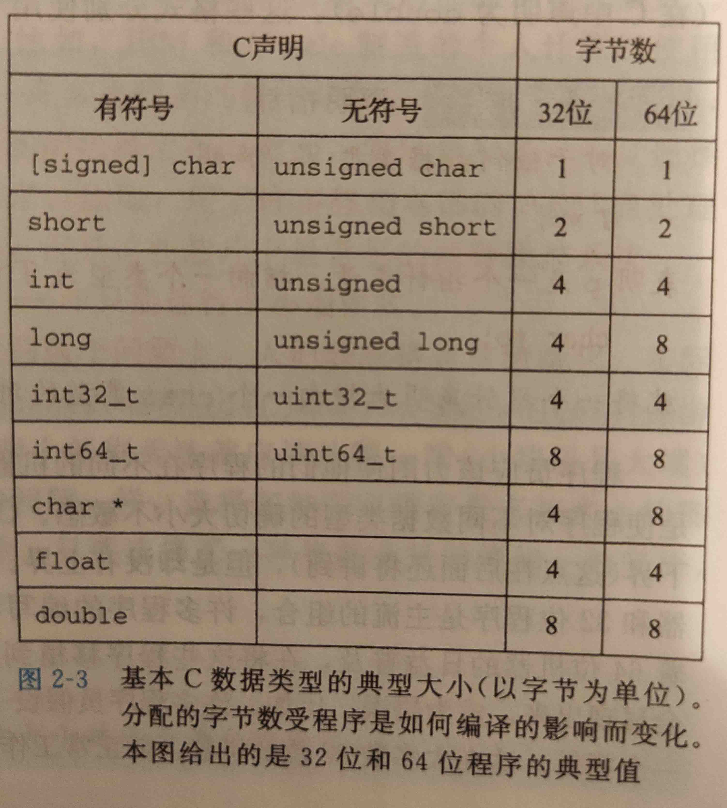

# 信息的表示和处理

## 简介

1. 现代计算机系统使用二值信号表示，这对于进行存储和执行计算的电子电路是否可靠
2. 单个位不是非常有用，但是当把位组合在一起，再加上某种解释，就能够表示任何有限集合的元素
   1. 一个二进制系统，我们能够用位组来编码非负数。
   2. 通过使用标准字符码，能够对于字母符号编码
   3. 负数表示和实数近似值的编码
      1. 无符号编码
      2. 补码
      3. 浮点数
3. 计算机就是通过有限位来对一个数字编码，因此结果太大不能表示某些运算就会溢出

 ## 信息存储

### 简介

1. 大多数程序使用8位的块，或者字节。作为最小的可寻址内存单元
2. 机器级程序将内存视为一个巨大的字节数组。(成为虚拟内存 - virtual memory)
3. 内存中每一个字节都有一个唯一的数字来标识，称之为他的地址(address), 所有可能地址的集合就称之为虚拟地址空间(virtual address space).
4. 这个虚拟地址空间只是一个展现给机器级程序的概念性映像，实际的实现是将动态随机访问存储器(DRAM), 闪存，磁盘存储器，特殊硬件和操作系统软件结合起来，为程序提供一个统一的字节数组。
5. 内容概述
   1. 编译器和运行时系统如何将存储器空间划分为更可管理的单元，来存放不同的程序对象(program object), 即程序数据，指令和控制信息
   2. 可以使用各种机制来分配和管理程序不同部分的存储，这种管理完全是在虚拟地址空间里完成的。
      * 例如C语言中的一个指针的值(无论指向什么)都是某个存储块的第一个字节的虚拟地址。
      * C编译器还把每个指针和类型信息关联起来，这样就可以根据指针的类型，生成不同的机器级代码来访问存储在指针所指向位置处的值
      * 但是尽管C编译器维护这个类型信息，但是生成的机器指令并不包含关于类型的信息。每个程序块都可以视为一个字节块

### 十六进制表示法

* 常用的进制格式为二进制和十进制， 但是二进制太过冗长，十进制转换不方便， 于是引入了16进制
* 十六进制和二进制转换： 四位二进制数相当于一位十六进制数

### 字数据大小

* 每台计算机都有一个字长(word size), 指明指针数据的标称大小(nominal size), 因为虚拟地址是以这样一个字来编码的，所以字长决定的最重要的系统参数就是虚拟地址空间的最大大小。
* 大多数64位应用也可以运行32位字长机器编译的程序。
  * `gcc -m32 prog.c`, `gcc -m64 prog.c`
* 计算机字长和C语言数据类型对应关系
  * 

### 寻址和字节顺序

* 对于跨越多个字节的程序对象，我们必须建立两个规则。

  1. 这个对象的地址是什么
  2. 以及在内存中如何排列这些字节
     * 几乎所有机器上，多字节对象都被存储为连续的字节序列，对象的地址为所使用字节中最小的地址
     * 如x为int类型值，`&x=0x100`, 那么这四个字节存储在`0x100, 0x101, 0x102, 0x103`
     * 大端， 小端
       * 大端： 低字节在低地址
       * 小端： 低字节在高地址
     * 许多intel兼容机都采用小端形式，而IBM和oracle大部分采用大端形式
     * 许多比较新的处理器是双端法，也就是可以配置为是小端格式还是大端格式
       * 但一般选择了特定操作系统，那么字节顺序就固定下来了

* 大多数情况，程序员对于机器使用的字节顺序是完全不可见的。无论那种类型机器都会得到同样的结果

  1. 不过当不同类型机器之间通过网络传送二进制数据时，一个小端机器发送数据到大端机器(或反过来)。接收程序会发现，子里的字节成了反序的
      
  * 所以网络程序代码编写必须遵守已建立的字节顺序的规则，确保发送机器将他的内部表示转换成网络标准，而接受机器将网络标准转换为内部表示
      
  1. 当阅读表示整数数据的字节序列时，字节顺序也很重要(如检查机器级程序时)
      * `4004d3: 01 05 43 0b 20 00    add  %eax, 0x200b43(%rip)`
      * 由反汇编生成，现在我们知道`01 05 43 0b 20 00`是一条指令的字节表示，这条指令是把一个字长的数据加到一个值上，可以看出指令后四位就是操作数(小端格式)
      
  1. 当编写规避正常的类型系统的程序时。

      * 在C语言中，可以通过使用强制类型转换(cast), 或者联合(union)来允许以一种数据类型引用另一种数据类型的对象，并且这种数据类型与创建这个对象的数据类型不一致

      *   demo

        ```c
        #include <stdio.h>
        
        typedef unsigned char * byte_pointer;
        
        void show_bytes(byte_pointer start, size_t len) {
            size_t i;
            for (i = 0; i < len; i++){
                printf("%.2x", start[i]);
            }
            printf("\n");
        }
        
        void show_int(int x) {
            show_bytes((byte_pointer)&x, sizeof(int));
        }
        
        void show_float(float x) {
            show_bytes((byte_pointer)&x, sizeof(float));
        }
        
        void show_pointer(void *x) {
            show_bytes((byte_pointer)&x, sizeof(void *));
        }
        ```

### c相关常识

1. 使用typedef来命名数据类型
   * typedef提供了一种给数据类型命名的方式，能够提供代码可读性
   * 例如
     * `typedef int * int_pointer`
2. 使用printf格式化输出
   * `printf, fprintf, sprintf`
3. 指针和数组
   * 我们可以看到指针和数组之间的紧密联系，指针和数组表示法

### 表示字符串

* C语言中，字符串被编码为一个以null字符结尾的字符数组。每个字符都由某个标准编码来表示。最常见的就是ascii码
* Ascii适合编码英语文档，但是完全不适合俄语，中文等，所以提出了很多其他的编码方案，例如unicode
  * 基本编码： 称为unicode的统一字符集，使用32位标识字符，之后又出现了utf-8编码，对于常用编码采用一个字节，中文采用三个字节

