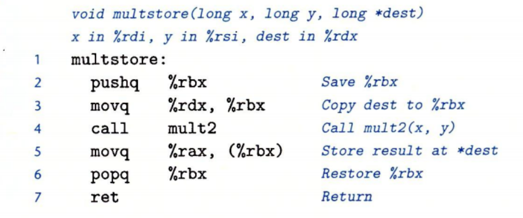
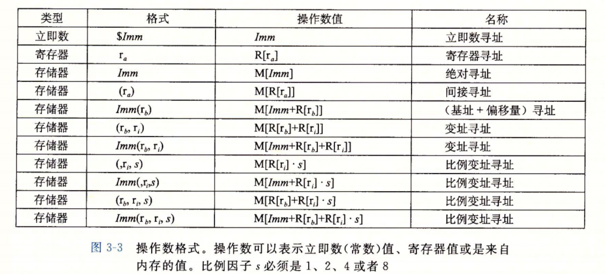

# 程序的机器级表示

## 简介

1. 计算机执行机器代码，使用字节序列编码低级的操作，包括处理数据，管理内存，读写存储设备上的数据，以及利用网络通信。
2. 编辑器基于汇编语言的规则，目标机器的指令集和操作系统遵顼的惯例生成机器指令。
   * GCC编译器以汇编代码的形式输出，汇编代码时机器代码的文本标识，给出程序中的每一条指令。然后GCC调用汇编器和连接器，根据汇编代码生成机器代码。
   * 阅读汇编代码是一种很重要的能力，我们能够理解编译器的优化能力，分析代码中的隐含的低效率。
   * 例如： 使用线程包写并发程序时，了解不同的线程是如何共享程序数据或保持数据私有，以及准确知道如何在哪里访问共享数据。
   * 而且： 程序遭受攻击的许多种方式中。都涉及程序存储运行时控制信息的方式的细节。许多攻击利用了系统程序中的漏洞重写信息，从而获得系统的控制权。

## 程序编码

### 编译简介

1. 假如一个c程序，有两个文件p1.c和p2.c
   * `gcc -Og -o p p1.c p2.c`
     * `-Og`: 告诉编译器使用会生成符合原始C代码整体结构的机器代码的优化等级

### 机器级代码

1. 正如前面所说，计算机系统使用了多种不同形式的抽象，利用更简单的抽象模型来隐藏实现的细节。其中两种抽象尤为重要
   1. 指令集体系结构或指令集架构(Instruction Set Architecture, ISA)： 定义机器级程序的格式和行为，定义了处理器状态，指令的格式，以及每条指令对状态的影响。(大多数ISA，将程序的行为描述成好像每条指令都是顺序执行)
      * 硬件上远比描述的精细复杂，他们并非的执行多条指令，但可以保证整体行为和ISA指定的一致
   2. 机器级程序使用的内存地址是虚拟地址： 提供的内存模型，看上去就是一个非常大的字节数组

2. x86-64的机器代码和原始C代码差别非常大。一些通常对C程序员隐藏的处理器状态都是可见的。
   1. `程序计数器(PC)`: 在x86-64中使用`%rip`表示，给出将要执行的下一条指令在内存中的地址
   2. `整数寄存器`： 包含16个命名的位置，分别存储64位的值，这些寄存器可以存储地址或整数数据。
      * 有的寄存器被用来记录某些重要的程序状态， 
      * 其他寄存器用来保存临时数据(参数，局部变量)，以及函数的返回值
   3. `条件码寄存器`： 保存着最近执行的算术或逻辑指令的状态信息，他们用来实现控制流或数据流中的条件变化
   4. `一组向量寄存器`： 可以用来存放一个或多个整数或浮点数值
   
3. 程序内存包含
   1. 程序的可执行机器代码
   2. 操作系统需要的一些信息
   3. 用来管理过程调用和返回的运行时栈
   4. 以及用户分配的内存块(比如使用malloc分配的)
   
4. 程序内存使用虚拟地址，但是任意时刻只有有限的一部分虚拟地址是合法的，在目前x86-64实现中, 高16位需要置0。操作系统负责管理虚拟地址空间，将虚拟地址翻译为处理器内存中的物理地址

5. 示例操作
   1. 得到汇编代码: `gcc -Og -S mstore.c`
   2. 得到intel格式的汇编代码: `gcc -Og -masm=intel mstore.c`
   3.  反汇编操作`objdump -d mstore.o`
   4. 反汇编生成intel: `objdump -d -M intel mstore.o`
   
6. 反汇编操作 `objdump`

   * x86-64指令长度从1到15个字节不等(常用的指令和操作数少的指令较短)
   * 设计指令格式的方式是，从某个给定位置开始，可以将字节唯一的解码成机器指令
   * 反汇编器只是基于机器代码文件中的字节序列来确定汇编代码的，不需要访问程序源代码。
   * 反汇编器和gcc生成的汇编代码有细微差别。例如省略了指令结尾的q

7. 加上函数头可以生成可执行函数格式

   1. 执行文件中，函数对应的汇编代码和目标文件中基本一致。
   2. 连接器会将目标文件中的代码地址移到一段不同的地址访问中。
   3. 链接器的任务之一就是为函数调用找到匹配的函数的可执行代码位置

8. gcc汇编代码说明

   1. 所有以`.`开头的行都是指导汇编器和连接器工作的伪指令。我们通常可以忽略这些行
      * 

   2. intel 和 ATT格式汇编 (diff)
      1. intel代码省略了指示大小的后缀. 例如(push, mov)
      2. intel代码省略寄存器名字前面的%
      3. intel代码用不同的方式描述内存中的位置`QWORD PTR [rbx]`
      4. 在多个操作数，列出的操作数的顺序相反

## 数据格式

### 基本前言

* 由于从16位体系结构拓展成32位

  * intel使用术语`字(word)`表示16位数据
  * 32位为双字(double words)
  * 64位为四字(quad words)

* c和汇编类型对照

  * 

  * 汇编层级： 传送指令都有四个变种
    * movb
    * movw
    * movl
    * movq

## 访问信息

### 通用寄存器

* 一个x86-64的中央处理器(cpu)包含一组16个存储64位值的通用目的寄存器。用来存储整数数据和指针
  * `%rax`: 返回值
  * `%rbx`: 被调用者保存
  * `%rcx`: 第四个参数
  * `%rdx`: 第三个参数
  * `%rsi`: 第二个参数
  * `%rdi`: 第一个参数
  * `%rbp`: 被调用者保存
  * `%rsp`: 栈指针，栈顶
  * `%r8`: 第五个参数
  * `%r9` : 第六个参数
  * `%r10`: 调用者保存
  *  `%r11` : 调用者保存
  * `%r12` : 被调用者保存
  * `%r13` : 被调用者保存
  * `%r14` : 被调用者保存
  * `%r15` : 被调用者保存
* 每个通用寄存器位8个字节(64位)，对于生成小于8字节结果的指令，寄存器中剩下的字节会如何
  1. 对于生成1字节和两字节结果的指令，会保持剩下的字节不变
  2. 对于生成4字节的指令，会把高位的四个字节置零

### 操作数指示符 - 基本寻址方式

* 大多数指令有一个或者多个操作数(operand), 指示出执行一个操作中要使用的源数据值，以及放置结果的目的位置
  * x86支持多种操作数格式
    * 源数据值可以以
      1. 常数形式
      2. 寄存器读出
      3. 内存读出
    * 结果可以放置在
      1. 寄存器中
      2. 内存中
    * 各种不同的操作数分为三种类型
      1. 立即数
         * `$ + 标准C表示法表示的整数`
           * `$-587`
           * `$0x1F`
      2. 寄存器
         * 寄存器的地位1字节，2字节，4字节，8字节中一个作为操作数
      3. 内存引用
         * 会根据计算出来的地址(通常称为有效地址)访问某个内存位置
         * 标识为: `Mb[Addr]`: 表示内存从地址Addr开始的b个字节引用
         * 内存寻址有用很多形式
           * `Imm(rb,ri,s)`: 表示的是最通用的形式
             1. 一个立即数偏移
             2. 一个基址寄存器 rb (必须为64位寄存器)
             3. 一个变址寄存器 ri (必须为64位寄存器)
             4. 和一个比例因子 s (必须为1, 2,4,8)
           * 有效地址计算
             * `Imm + R[rb] + R[ri] * s`
  * 寻址方式图解
    * 

### 数据传输指令

1. 传送指令 MOV类： 把数据从源位置复制到目的位置，不做任何变化
   1. movb
   2. movw
   3. movl
   4. movq
   5. 