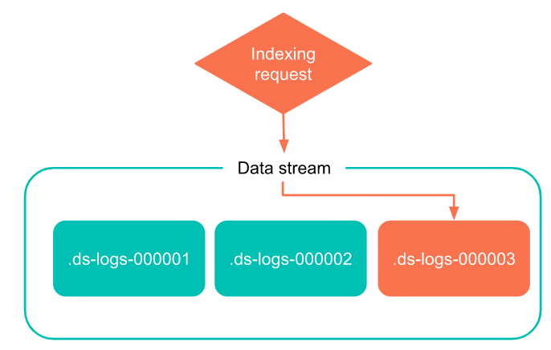

# Data streams

* Data Stream是一个方便的，可伸缩的方式去获取，搜索并且管理持续生成的时序数据
* 时序数据，类似日志，数据会随着时间增长。虽然将整个时序数据存放在一个索引中更加简单，但是通常，将大量的数据存储在多个基于时间的索引是更加高效并且符合经济利益的。多个索引能够让您将老的，低频查询的数据移动到低价机器上，并且当索引不在需要时，能够让你删除索引，以便减少花销。
* data stream被设计为让您能够两全其美
  1. 能够使用单一资源名称请求的简单性
  2. 多个索性在存储，可伸缩性和节省成本方面的优势
* 您能够直接提交索引和查询请求到data stream. data stream 会自动路由请求到到隐藏在背后的背后索引(backing indices)
* 您能够使用声明周期管理来自动的管理这些背后的索引。ILM使您可以自动启动新的后备索引，将索引分配给不同的硬件，删除旧的索引以及根据您设置的年龄或大小标准执行其他自动操作。使用data streams和ILM根据预算、性能、弹性和保留需求无缝地扩展数据存储。

## 什么时候使用data streams

* 我们推荐您如下情况使用
  * 使用es来获取，搜索和管理大卷时序数据
  * 想要通过使用ILM自动化管理来拓展规模并降低成本
  * 在ES中索引大量的时序数据，但是很少删除或者更新单个文档

## Backing indices(背后索引)

* 一个data stream有多个背后索引组成，背后索引是被隐藏的，并且会自动创建被用于存储stream 文档
  * 
* 要创建一个背后索引，每个data stream需要一个匹配的`index template`, 这个模板扮演了data stream 背后索引的一个生成蓝图。它定义了如下内容
  1. 一个或多个通配符，匹配data stream名字
  2. `mappings`和`settings`对于data stream背后索引
  3. 这个模板仅仅被data stream所使用
* data stream中的每个文档索引必须有一个`@timestamp`字段，data stream索引模板能够将该字段映射为`data`或者`data_nanos`类型。 如果模板没有指定一个映射，`@timestamp`字段会被自动默认映射为date类型
* 同一个索引模板能够被用来创建多个数据流

## 生成

* 每一个data stream跟踪他的生成： 一个被零填充为6为的数字，用作数据流支持索引的累积计数
* 次计数包括该流的所有以删除索引。每当新的后备索引添加到六，生成就会增加。
* 当一个后备索引被创建时，这个索引使用如下命名约定
  * `.ds-<data-stream>-<generation>`
  * 例如： `web-server-logs`， data stream的代数式34. 这个data stream最近被创建的后备索引的名称为: `.ds-web-server-logs-000034`
  * 因为每一个新的后备索引都会增长代号，所以高代号的数据包含近期的数据，低代号的索引包含老数据。
  * 后备索引的名称在创建后可能会由于收缩，还原或其他操作而更改。 但是，重命名支持索引不会将其与数据流分离。

## Read requests

* 当一个读取请求被发送到data stream, 他路由这个请求到他的所有后备索引。例如，一个搜索请求发送到data stream将会查询他所有的后备索引
  * 

## Write index

* 最近创建的后备索引式数据流唯一的写索引，数据流将所有对新文档的索引请求路由到这个索引。
  * 
* 你不能增加新的文档到stream其他的后台索引。甚至不能直接发送请求到这些索引
* 因为只有一个能够提取新文档的索引，所以不能在写索引上执行可能妨碍索引的操作。具体操作包括
  * Clone
  * Close
  * Delete
  * Freeze
  * Shrink
  * Split

## Rollover

* 当一个数据流被创建，一个后台索引自动被创建。因为这一个索引式最近被创建的后台索引，所以他扮演了流写入索引的作用
* 一个rollover为`data stream`创建一个新的后备索引, 这个新后备索引成为流的写入索引。代替当前索引，并增长索引标号。
* 更多方面，推荐使用ILM来自动`rollovers` `data streams`, 这让您自动滚动当前写索引，当遇到指定的规则，例如最小年龄或大小
* 无论如何，您能够使用`rollover api`去手段启动一个rollover, 

## 只能追加

* 对于大多数时序数据使用案例，现有数据很少被更新，所以，data stream被设计为只追加的
* 您能够发送`indexing requests for new documents`直接到一个data stream. 无论如何，您不应该将update或者delete请求直接发送到数据流
* 可替代的，您可以使用`update by query`和`delete by query`API去更新或者删除在data stream中的文档。

# Set up a data stream(建立一个data stream)

* 建立一个`data stream`需要如下步骤
  1. 检查先决条件
  2. (可选的)： 配置ILM声明周期政策对于data stream
  3. 为data stream创建索引模板
  4. 创建一个data stream
  5. 获取关于data stream的信息，去验证他是否存在
  6. 安全的数据流
* 你创建`data stream`之后，你能使用他索引，搜索，和其他支持的操作
* 如果比不需要他了，你可以删除data stream和他的后备索引

## 预先配置

* Elasticsearch数据流仅用于时间序列数据。每一个索引到data stream中的文档必须包含一个@timestamp字段，这个字段必须被映射为一个`date`或者`date_nanos`字段类型
* DataStream最适合时序数据，只追加使用案例，如果你频繁的需要更新删除，推荐使用index alias和index template替代

## (可选) 配置一个ILM生命周期策略对于data stream

* 你能使用ILM去自动管理一个data stream的后备索引，流入你能够使用ILM来

  * 为data stream创建一个新的写索引,当当前年龄或size到达预设值
  * 移动老索引到低价设备
  * 删除过时后备索引，以执行数据保留标准

* datastream 使用ILM，你必须配置`configure a lifecycle policy`. 生命周期规则必须包含索引的自动操作，和此类操作的触发器。

* 你能够创建一个规则，使用创建创建索引api

  ```json
  PUT /_ilm/policy/my-data-stream-policy
  {
    "policy": {
      "phases": {
        "hot": {
          "actions": {
            "rollover": {
              "max_size": "25GB"
            }
          }
        },
        "delete": {
          "min_age": "30d",
          "actions": {
            "delete": {}
          }
        }
      }
    }
  }
  ```

## 创建data stream 索引模板

* 一个data stream使用一个索引模板去配置后备索引，一个数据流模板必须指定
  * 一个或者多个索引模式，匹配数据流名(the name of stream)
  * mapping和settings对于stream 后备索引
  * 这个模板只适用于数据流
  * 模板优先级
* 注意：
  * ES有内置的索引模板对于`metrice-*-*`和`log-*-*`索引模式，每一个的优先级都是100，Elastic Agent使用这些模板去创建data stream, 如果你使用Elastic Agent, 分配你的索引模板一个低于100的优先级，避免覆盖内建模板
  * 为避免意外应用内置模板，请使用非重叠索引模式或为具有重叠模式的模板分配优先级高于100。
* 每一个索引到数据流的文档必须有一个@timestamp字段，这个字段可以index template中被映射为date. 在这个映射中能过够包含其他的mapping parameters, 例如format, 
* 我们推荐使用ILM去管理data stream的后备索引，指定lifecycle 名字使用`index.lifecycle.name`

### 创建index template(data streams)

* 你能够使用put api创建模板, 这个模板包含一个data_stream对象有一个空的`{}`, 暗示索引只用于data streams

* 创建

  ```json
  PUT /_index_template/my-data-stream-template
  {
    "index_patterns": [ "my-data-stream*" ],
    "data_stream": { },
    "priority": 200,
    "template": {
      "mappings": {
        "properties": {
          "@timestamp": { "type": "date_nanos" }    
        }
      },
      "settings": {
        "index.lifecycle.name": "my-data-stream-policy"
      }
    }
  }
  ```