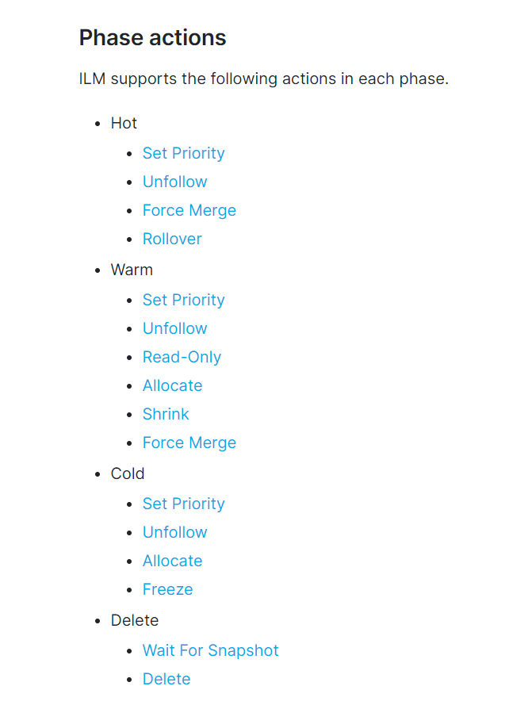

# ILM： 管理索引生命周期

* 你能够配置索引生命周期(index lifecycle management, ILM),政策去自动管理索引。以根据您的性能，弹性和保留需求自动管理索引，例如以下几点
  * 当索引达到一定大小或者文档数量时，滚动新索引
  * 创建一个新索引，每天，每周，或者每月，并且归档之前的
  * 删除过时的索引以执行数据保留标准
* 你能够创建并管理索引生命周期规则通过Kibana管理或者ILM api, 当您位Beats或者Logstash Elasticsearch输出插件启用索引生命周期管理时，默认策略将自动配置

## ILM概述

* 你能够创建和应用索引生命周期管理(ILM)股则去自动的管理你的索引，根据您的性能，弹性和保留要求
* 索引声明周期规则可以触发如下操作
  * Rollover(翻转): 创建一个新的所以对于一个滚动目标，当存在的索引到达一个确定的大小，或者数量的文档，一个滚动目标可以是一个索引别名或者一个数据流
  * Shrink(Shrink): 减少索引中的主碎片数量
  * Force merge: 手动触发合并以减少索引的每个分片中的段数，并且释放已删除文档的使用空间
  * Freeze: 使得索引只读并最小化他的内存占用
  * Delete: 永久的移除一个索引，包括他的所有数据和元数据
* ILM使得管理在热-暖-冷架构中的索引更加容易，这是十分常见的，当你处理时间序列数据例如日志和指标
* 你能够指定
  * 最大分片数量，文档的数量或者希望滚动到的新索引的年龄
  * 不在更新索引的点，主分区的碎片可以被减少
  * 何时强制合并以永久移除标记为移除的文档
  * 索引能够被移动到低性能硬件的指标
  * 当可用性不是那么关键时，复制的数量能够减少
  * 什么时候索引能够被安全的删除
* 例如，如果您要将来自一组ATM的指标数据索引到ES中，则可以定义一个策略，如下：
  * 当索引到达50GB， 滚动到一个新索引
  * 将旧索引移动到warm阶段，将其标记为只读，并将其缩小为单个碎片
  * 在7天以后，移动索引到冷阶段，并且将其移动到低性能硬件上
  * 一旦到达需要的30天保留期，删除索引
* 注意：
  * 要使用ILM，集群中的所有节点必须运行相同的版本，尽管可以在混合版本集群中创建和应用策略，但是不能保证他们会按照预期工作，尝试使用包含集群中所有节点都不支持的操作的策略会导致错误。

## ILM 概念

### Index lifecycle

* ILM 定义四种索引生命周期阶段
  * HOT： 这个索引被活跃的更新和查询
  * Warm: 这个索引不再被更新但是仍旧被查询
  * Cold: 这个索引不再被更新，并且很少被查询，数据信息仍旧妖气是可达的，但是如果查询速度很慢也是可以接受的
  * Delete: 这个索引不再被需要，能够被安全的删除。
* 一个索引的生命周期规则指定哪一个阶段是适当的，每个阶段执行什么操作，以及何时在两个阶段间转换
* 你能够手动应用一个生命周期规则当你创建索引时，对于时间序列索引，你需要将生命周期规则和用于创建新索引的索引模板关联起来。当索引滚动时，手动应用的策略不会自动应用到新索引。

#### Phase transitions

* ILM根据索引的年龄在索引的生命周期中移动索引。为了控制这个转变的时间，你应该设置最小年龄对于每一个阶段，对于一个索引移动到下一个阶段，所有在当前阶段的行为都必须完成，并且索引的年龄必须老于下一阶段的最小年龄
* 默认的最小年龄时0， 这将导致当前阶段的所有操作完成后立即将索引移动到下一阶段
* 如果索引有未分配的碎片，并且集群运行状况为黄色，则该索引仍然可以根据器索引生命周期管理策略转换到下一阶段，然而由于Elasticsearch只能在绿色集群上执行某些清理操作，所以可能出现意想不到的副作用
* 为了避免增加磁盘使用和可靠性问题，应及时处理集群健康问题。

#### Phase exection

* ILM 控制一个阶段中action的执行顺序，和执行哪些步骤来为每个操作执行必要的索引操作。
* 当一个索引进入一个阶段，ILM在索引元数据中缓存阶段定义。这确保规则更新不会将索引置于永远不能退出该阶段的状态。如果改变能够被安全的应用，ILM更新缓存阶段定义，如果不能阶段执行继续使用缓存的定义。
* ILM周期性的运行，检查一个索引是否达到了周期性指标，并且执行所有需要的步骤，为了避免特殊情况，ILM可能需要运行一次以上才能执行完成某项操作所需的所有步骤。(例如): 如果ILM去顶一个索引达到了滚动状态，他开始执行阶段需要去完成滚动行为。如果他到达了无法安全进行下一步的位置，执行停止。当下一次LIM运行，ILM从他停止的地方继续执行。这意味着尽管`indices.lifecycle.poll_interval`: 被设置成10分钟，并且一个索引到达了滚动点，则在完成滚动之前可能需要20分钟。

#### 阶段事件

* ILM下列行为在每一个阶段中
* 图解
  * 

### Rollover

* 当索引时序数据类似日志或者指标时，您不能无限的写入一个索引。为了满足您的索引和搜索性能需要并且管理资源使用，您应该将数据写入到一个索引直到到达一个阈值，然后创建一个新的索引并写入新的数据到他。使用rolling indices 确保你
  * 优化活动索引，以在高性能热节点上获得高接收速率。
  * 优化搜索表现在warm nodes上
  * 转移老的，低频访问数据到低价设备
  * 删除整个索引来删除数据，按照你的保留策略
* 我们推荐使用`data streams`去管理时序数据， `Data streams`自动跟踪写踪迹，并且保持配置最小。
* 每一个`data stream`需要一个索引模板，包含
  * 一个名字或者通配符(*)对于data stream
  * 数据流simestamp field. 这个字段必须被映射为`date`或`date_nanos`类型， 必须包含在每一个索引到数据流的文档中
  * 创建每一个后备索引时将应用映射和设置
* `Data Streams`被设计为只能追加数据，其中数据流名称可以用作操作(读，写，翻转，收缩)目标。如果你的使用案例需要数据被更新，你能够使用`indices aliases`。以下是一些配置步骤和概念
  * 索引模板: 用于指定序列中每个新索引的设置。您可以优化次配置以进行提取，通常使用与热点一样多的分片
  * 一个索引别名： 引用这索引集合的入口
  * 一个单独索引，被设计作为写索引，这是一个活动索引，处理所有的写入请求，在每一个rollover, 这个新的索引将会成为写索引
* rollover
  * ILM确保你自动的`roll over`到一个新的索引基于索引数量，文档数量，或者年龄。当一个rollover被触发， 一个新的索引被创建，写入alias被更新为新索引，并且所有随后的索引更新都会被写入到新的索引
  * `rolling over`到一个新的索引基于数量，文档数，或者年龄是比基于time-based rollover更加适合的
  * 任意时间滚动通常会导致许多小索引，这可能回对性能和资源使用产生负面影响

### Policy updates

* 您可以通过改变当前规则或则和选择到不同的规则来改变一个索引的生命周期或者一个滚动索引的集合如何被管理
* 为了确保规则更新不会使得当前所以进入不能退出当前状态的情况，当进入阶段时，阶段定义将缓存在索引元数据中，此缓存的定义用于完成该阶段。
* 当索引进入到下一个阶段，它使用更新策略中的阶段定义

#### 如何应用更改

* 当策略被初始化提交给index, index得到最新版本的策略。如果你更新策略，规则版本就会发生冲突，并且ILM将会发现这个索引使用一个早期版本需要被更新
* 改变`min_age`不会传播到缓存定义，改变一个阶段的`min_age`不会影响当前正在执行该阶段的索引。
* 例如，如果你创建了一个没有指定`min_age`的热阶段策略，当策略被提交时，索引立即进入热阶段。如果你更新这个策略进入热阶段的`min_age`为1天，那么对于已经处于热阶段的索引是没有影响的。但是在策略更新之后创建的索引必须`a day`之后才会进入热阶段

#### 新政策如何实施

* 当你提交一个不同的策略到一个管理索引，索引完成当前阶段使用先前策略的缓存定义。索引开始使用新规则，当他移动到新的阶段。

### Automate rollover with ILM

* 当您连续的索引带有时间戳的文档进入Elasticsearch, 您通常应该使用data stream, 可以周期性的 `roll over`到一个新的索引。 这确保您实现一个热-暖-冷架构去为了满足最新数据的性能需求，需要控制长期成本，执行保留策略，并且仍然可以最大限度的利用数据
* `Data streams`最适合于只追加使用案例，如果你需要去周期性更细或者删除存在的文档通过多个索引，我们推荐使用一个索引别名和索引模板替代。你仍旧能够使用ILM去管理和`rollover`别名索引
* 去自动`rollover`和管理`data stream`使用ILM，你应该
  1. 创建一个声明周期规则： 定义合适的阶段和行为
  2. 创建一个索引模板： 去创建`data stream`，并为支持索引应用ILM策略以及索引设置和映射配置
  3. 验证索引被移动通过声明周期阶段按照被期盼的

#### Create a lifecycle policy

* 一个声明周期规则指定了索引生命周期的各个阶段和各个阶段的行为，一个生命周期能有四个阶段： hot, warm, cold, delete

* 例如，你能够定义一个timeseries_policy有两个阶段

  * 一个hot阶段定义了一个`rollover`行为，一个索引到达`max_size`超过50G ,或者`max_age`30天

  * 一个删除阶段： 去设置`min_age`去移除索引在`rollover`90天之后。注意这个时间关联`rollover`时间，而不是索引创建时间

  * api

    ```
    PUT _ilm/policy/timeseries_policy
    {
      "policy": {
        "phases": {
          "hot": {                      
            "actions": {
              "rollover": {
                "max_size": "50GB",     
                "max_age": "30d"
              }
            }
          },
          "delete": {
            "min_age": "90d",           
            "actions": {
              "delete": {}              
            }
          }
        }
      }
    }
    ```

#### Create an index template to create the data stream and apply the lifecycle policy

1. 要设置数据流，请首先创建一个索引模板以指定生命周期策略。 因为模板是用于数据流的，所以它还必须包含data_stream定义。

2. 例如，您可以创建一个timeseries_template用于将来的名为timeseries的数据流。

3. 为了使ILM能够管理数据流，模板配置了一个ILM设置

   * `index.lifecycle.name`: 指定要应用于数据流的生命周期策略的名称。

4. 创建模板

   ```json
   PUT _index_template/timeseries_template
   {
     "index_patterns": ["timeseries"],                   
     "data_stream": { },
     "template": {
       "settings": {
         "number_of_shards": 1,
         "number_of_replicas": 1,
         "index.lifecycle.name": "timeseries_policy"     
       }
     }
   }
   ```

#### 创建数据流

* 索引一个文档进入名字或者通配符定义在`index_patterns`在索引模板中。只要现有数据流，索引或索引别名尚未使用该名称，索引请求就会自动创建具有单个后备索引的相应数据流。 Elasticsearch会自动将请求的文档编入该后备索引，该索引也用作流的写索引。
* 当满足生命周期策略中的滚动条件时，将执行滚动操作
  * 创建第二代后备索引，名为.ds-timeseries-000002。 因为它是时间序列数据流的后备索引，所以来自timeseries_template索引模板的配置将应用于新索引。

#### 管理时序数据没有data stream

* 你能够使用索引别名去管理索引包含时序数据，并且`roll over`到一个新的索引
* 要使用索引别名通过ILM去自动`rollover`并且管理时序索引
  1. 创建一个声明周期规则定义合适的阶段和行为
  2. 创建一个索引模板去应用策略对于每一个索引
  3. 启动一个索引作为初始写入索引
  4. 验证索引移动通过声明周期阶段