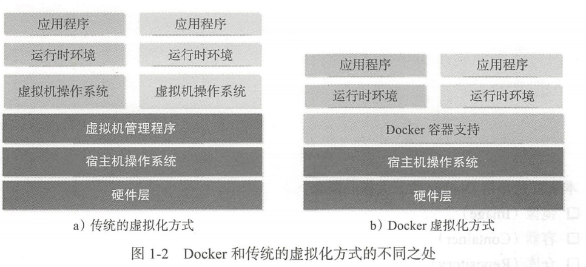

# 初识Docker与容器

## 前言

1. 如果说主机时代比拼的是单个服务器物理性能(比如CPU主频和内存,)的强弱,那么云时代,最为看重的则是凭借虚拟化技术所构建的集群处理能力
2. 一般看来,虚拟化技术既可以通过硬件模拟来实现,也可以通过操作系统软件来实现.而容器技术则更加优雅,他充分利用了操作系统本身的机制和特性,可以实现远超传统虚拟机的轻量级虚拟化.
3. 甚至有人把容器技术称之为新一代虚拟化技术,并将容器打造的云平台称之为容器云

## 什么是Docker

1. Docker开源项目背景

   1. Docker是基于Go语言实现的开源容器项目,诞生于2013年初,最初发起者是dotCloud公司.在2013年底,dotCloud公司直接改名为Docker,如今是最大的Docker容器服务提供商
   2. Docker项目已经加入Linux基金会,遵顼Apache2.0协议, 代码开发在[Docker源码](https://github.com/docker)项目,现今主流的操作系统Linux,mac,windows都已经支持Docker.
   3. Docker的构想是要实现"Build, ship and Run Any App, Anywhere "
      1. 就是通过对于应用的封装(Packaging), 分发(Distribution), 部署(Deployment), 运行(Runtime)生命周期进行管理达到应用组件级别的,"一次封装,到处运行"
      2. 这里的应用组件,既可以是一个Web应用,一个编译环境,也可以是一套数据库平台服务器,甚至是一个操作系统或者集群
   4. 基于Linux平台上的多项开源技术,Docker提供了高效,敏捷和轻量级的容器方案.可以说Docker首次为应用的开发,运行和部署提供了一战式的解决方案.

   2. Linux容器技术 -- 巨人的肩膀
      1. 最重要的技术就是Linux容器(Linux Containers, LXC)技术. 容器技术: 容器有效的将单个操作系统管理的资源划分到孤立的组中,以更好的在孤立的组之间平衡有冲突的资源使用需求.与虚拟化相比,这样既不需要指令级模拟,也不需要即时编译.容器可以在核心CPU本地运行指令,而不需要任何专门的解释执行,此外也避免了准虚拟化(para-virtualization)和系统调用替换中的复杂性
      2. LXC项目借鉴了前人成熟的容器设计理念, 并基于一系列新引入的内核特性,实现了更加具有拓展性的虚拟化容器方案, 更为关键的是LXC终于被集成到主流Linux内核中.
   3. 从Linux容器到Docker
      1. 在LXC基础上,Docker进一步优化了容器的使用体验,
         1. Docker提供了各种容器管理工具(分发, 版本, 移植等),让用户胡须关注底层操作
         2. Docker通过引入分层文件系统构建和高效的镜像机制,降低了迁移难度,改善了用户体现
      2. 早期Docker代码实现基于LXC. 从0.9版本开始, Docker开发了libcontainer项目作为更广泛的容器驱动实现, 目前Docker还积极推动成了runC标准项目,并贡献给开放容器联盟,试图让容器的支持不在局限于Linux操作系统,而是更安全,开放,更具拓展性
      3. 容器的特性
         1. 可以将Docker容器理解为一种轻量级沙箱(sandbox).每个容器内运行着一个应用,不同的容器相互隔离,容器之间可以通过网络相互通信. 
         2. 容器的创建和停止十分快速,几乎跟创建和终止原生应用一致
         3. 另外容器自身对于系统资源的额外需求也十分有限

## 为什么要使用Docker

1. Docker容器虚拟化的好处
   1. 在云时代,开发者创建的应用必须要能够很方便的在网络上传播,就是必须脱离底层物理硬件的限制.同时必须是任何时间任何地点可以获取的. 所以必须创建一种新型的创建分布式应用程序的方式,快速分发部署
      * 而传统方式,应用程序和操作系统极大的耦合, 安装一组应用需要在一个独立的操作系统环境上做极大的配置,一般更换一个平台,一切需要重新配置
   2. 而Docker提供了一种更加聪明的方式,通过容器来打包应用, 解耦应用和运行平台.这就意味了迁移的时候,只需要在新的服务器上启动需要的容器就可以了.
2. Docker在开发和运维中的优势
   1. 更快速的交付和部署: 使用Docker, 开发人员可以使用镜像来快速构建一套标准的开发环境,开发完成之后,测试和运维人员可以直接使用相同的环境来部署代码,只要是开发测试过的代码,就可以保证生产环境无缝进行.
   2. 更高效的资源利用: 运行Docker容器不需要额外的虚拟化管理程序(Virtual Machine Manager, VMM, 已经Hypervisor)的支持, Docker式内核级别的虚拟化,可以实现更高的性能, 同时对资源的额外需求很低.
   3. 更轻松的迁移和拓展: Docker容器几乎可以在任意平台运行, 包括物理机,虚拟机,公有云,私有云,个人电脑, 服务器
   4. 更简单的更新管理: 使用Dockerfile, 只需要小小的修改配置,就可以替代以往大量的更新工作

## Docker与虚拟化

1. 虚拟化(virtualization)技术是一个通用的概念, 在不同的领域有不同的理解. 在计算领域,一般指的是计算虚拟化(computing virtualiztion), 或者通常说的服务器虚拟化.
2. 虚拟化的核心是对于资源的抽象, 目标往往是为了在同一个主机上同时运行多个系统或应用,从而提供系统资源的利用率, 并且带来降低成本, 方便管理和容错容灾等等好处.
   1. 虚拟化技术可以分为硬件虚拟化和软件虚拟化
      1. 硬件虚拟化: 很少
      2. 软件虚拟化
         1. 应用虚拟化
            1. 模拟设备
            2. Wine这样的软件
         2. 平台虚拟化
            1. 完全虚拟化: 虚拟机模拟完整的底层硬件环境和特权指令执行过程,客户操作系统无需进行修改, Vmware, virtualbox
            2. 硬件辅助虚拟化: 利用硬件主要是CPU的辅助支持(x86体系结构可用的硬件虚拟化技术包括intel-VT和AMD-V)处理敏感指令来实现完全虚拟化的功能.
            3. 部分虚拟化: 只针对部分硬件资源进行虚拟化,客户操作系统需要进行修改
            4. 超虚拟化: 部分硬件接口以软件的形式提供给客户机操作系统,客户操作系统许哟啊进习性修改
            5. 操作系统级虚拟化: 内核通过创建多个虚拟的操作系统实例(内核和库)来隔离不同的进程.
3. Docker和虚拟化技术
   * 