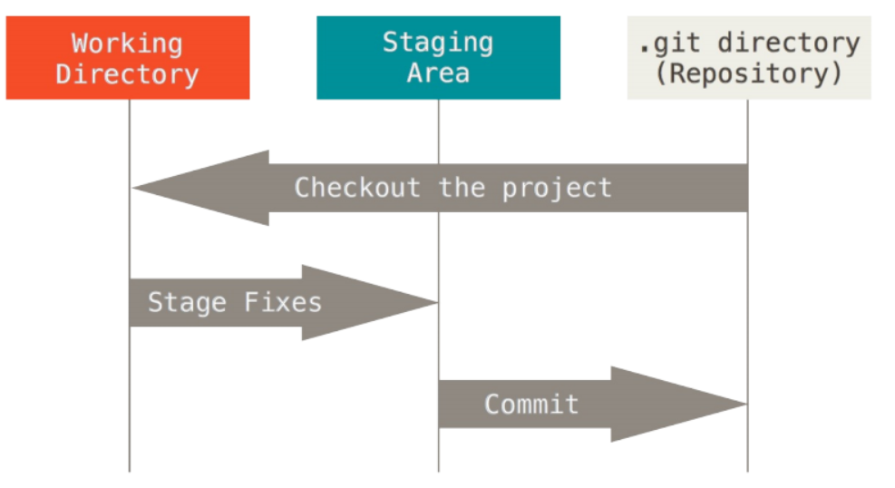

# 起步

## 关于版本控制

1. 版本控制
   * 什么是版本控制： 版本控制是一种记录一个或若干文件内容变化，以便将来查阅特定版本修订情况的系统
   * 有了版本控制系统，可以轻松的将某个文件回溯到之前的状态。查出最后是谁修改了哪个地方。

## Git简史

1. linux内核开源项目有众多的参与者，绝大多数Linux啮合维护工作都花在提交补丁和保存归档的繁琐事务，到2002年，整个项目组开始启用一个专有的分布式版本控制系统BitKeeper来管理和维护代码
2. 到了2005年，BitKeeper的商业公司同Linux开源社区结束合作，收回了Linux社区免费使用Bitkeeper的权力。于是Linux社区开发了新的版本控制系统
   1. 速度
   2. 简单的设计
   3. 对非线性开发模式的强力支持
   4. 完全分布式
   5. 有能力高效管理类似Linux内核一样的超大规则项目。

## Git基础

1. 直接记录快照，而非差异比较
   * Git和其他版本控制系统(包括Subversion和近似工具)主要差别在于Git对待数据的方法，概念上来区别，其他大部分系统以文件变更列表的方式存储信息
   * 但是Git，更像是把数据看作是对小型文件系统的一组快照，每次提交更新，或者在Git中保存项目状态时，它主要对当时的全部文件制作一个快照并保存这个快照的索引。如果文件没有修改，Git不在重新存储该文件，而是保留一个链接指向之前存储的文件。
2. 近乎所有的操作都是本地执行
   * Git中绝大多数操作都只需要访问本地文件和字段，一般不需要来自网络上的其他计算机的信息。
3. Git保证完整性
   * Git中所有数据在存储前都计算校验和，然后以校验和来引用。意味着不可能在Git不知情时更改任何文件内容或者目录内容
4. Git一般只添加数据
   * 执行Git操作，几乎只往Git数据库中添加数据，很难让Git执行不可逆操作，或者让他以任何方式清除数据。一旦提交快照到Git中，就难以在丢失数据。
5. 三种状态
   1. 已提交(committed)： 表示数据已经安全的的保存在本地数据库中。
   2. 已修改(modified)： 表示修改了文件，但还没有保存到数据库中
   3. 已暂存(staged)： 已暂存表示对于一个已经修改文件的当前版本做了标记，使之包含在下次提交的快照中。
6. 状态图解
   * 

## 初次运行前的配置

1. Git自带一个git config工具，来帮助设置控制Git外观的配置变量，这些变量存储在三个不同的位置
   1. `/etc/gitconfig`: 包含系统上每一个用户及他们仓库的通用配置，如果使用带有`--system`选项的`git config`，他会从此配置文件配置
   2. `~/.gitconfig`或`~/.config/git/config`: 只针对当前用户，可以传递`--global`让git读写此文件
   3. 当前项目的git目录的config文件(`.git/config`), 针对于该仓库

## 配置用户信息

1. 当安装好git, 第一件事就是设置用户名与，邮件地址(全局配置)
   * `git config --global user.name "jj"`
   * `git config --global user.email jj@163.com`