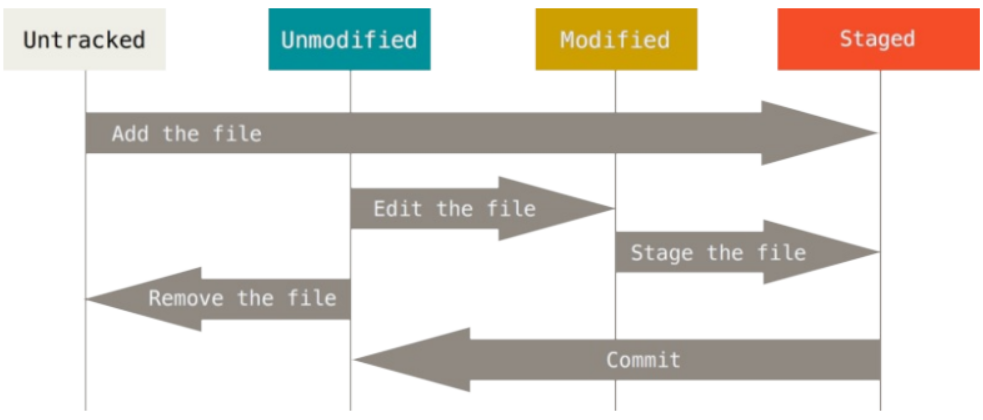
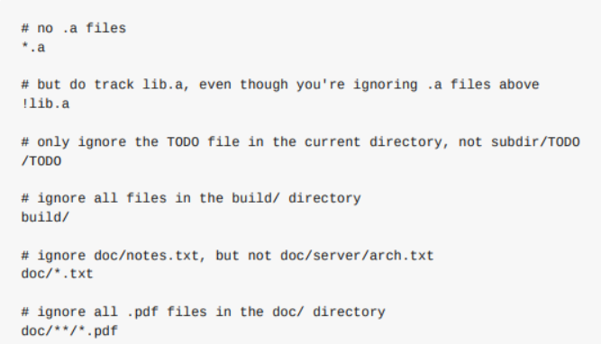

# git基础

## 获取git仓库

1. 在现有项目或目录下导入所有文件到git
   * `git init`
2. 从服务器克隆一个现有的git仓库
   * `git clone https://xx.com/xx.git`

## 记录每次更新到仓库

1. 工作目录下的每一个文件都有两种状态	
   1. 已跟踪: 被纳入版本控制的文件
      1. 未修改
      2. 已修改
      3. 已放入暂存区
   2. 未跟踪：除了已跟踪的文件， (既不存在于上次快照记录，也没有放入暂存区)
2. 声明周期图
   * 

## 检测当前文件状态

1. `git status`: 文件状态
2. 添加一个文件
   1. `echo 'My Project' > README`
   2. `git status`显示： Untracked files: 显示未跟踪文件，意味着Git之前提交没有这些文件

3. 跟踪新文件
   1. `git add README`
   2. `git status`显示： 文件已跟踪，并且已暂存
4. 暂存已修改文件
   1. 修改一个已跟踪文件，运行`git status`, 显示`changes not staged for commit`. 说明已跟踪文件的内容发生了变化，但还没有暂存这次更新
   2. 可以使用`git add`命令。（可以理解添加内容到下一次提交中）
      * 可以用它开始跟踪新文件
      * 或者把已经跟踪的文件放到暂存区
      * 还能用于合并时把有冲突的文件标记为已解决状态
5. 如果暂存后，再次修改暂存文件，然后再次查看
   * 发现文件存在于暂存区和未暂存区
   * 实际上，git不过是暂存了运行`git add`命令时的版本，而不是运行`git commit`工作目录中的当前版本

## 状态简单输出

* `git status`命令输出很详细， 可以使用`git status -s`或`git status --short`,得到简短的输出
* 语义
  * 新添加的未跟踪文件有`??`标记
  * 新添加到暂存区中的文件前面有`A`标记
  * 修改过的文件有`M`标记
    * `M`: 出现在右边表示该文件被修改了但是还没有放入暂存区
    * `M`: 出现在左边的M表示该文件被修改，并且放入了暂存区

## 忽略文件

* 有些文件不需要纳入git管理，例如： 日志文件，编译中间文件，可以创建`.gitignore`文件
  * `*.[oa]`: 以o, a结尾的文件
  * `*~`: 波浪线结尾的文件
* 忽略规则
  * 所有空行或以`#`开头都会被忽略
  * 可以使用标准的glob模式匹配
    * shell简化的正则
      * `*`: 零个或多个任意字符
      * `[abc]`: 之中任意一个
      * `?`: 匹配任意一个字符
      * `**`： 表四匹配任意中间目录: `a/**/z`
  * 匹配模式可以使用`/`开头防止递归。
  * 匹配模式可以以`/`结尾指定目录
  * 要忽略指定模式以外的文件，可以在模式前加`!`取反
* git忽略文件
  * 

## 查看已暂存和未暂存修改

* `git status`可能过于模糊，如果想要知道具体的修改是什么，可以使用`git diff`
* 用途
  * 确定当前做的哪些更新还没有暂存
  * 确定有哪些更新已经准备好下次提交