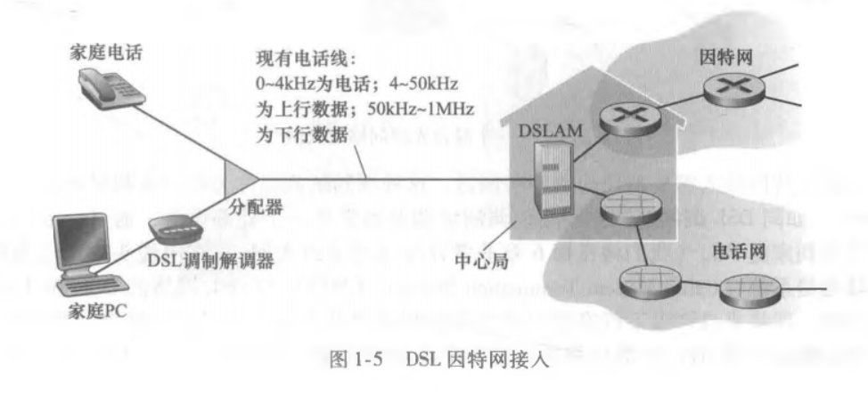

# 计算机网络和因特网

## 概述

1. 什么是因特网
   * 能够描述因特网的具体构成： 既构成因特网的基本硬件和软件组件
     * 因特网是一个世界范围的计算机网络，网络中的设备都可以称之为主机或端系统
     * 端系统通过通信链路和分组交换机连接到一起。
     * 最关键的两种分组交换设备： 路由器 和 链路层交换机
     * 端系统通过因特网服务提供商(Internet Service Provider, ISP)接入因特网。
     * 端系统，分组交换机和其他因特网部件都要运行一系列的协议(protocol). 这些协议控制因特网中信息的接受和发送
   * 能够根据`为应用程序提供服务的联网基础设施`来描述因特网
  * 与因特网相连的端系统提供了一个套接字接口(socket interface), 该接口规定了运行在一个端系统上的程序请求因特网基础设施向运行在另一个端系统上的特定目的程序交付数据的方式。
2. 什么是协议
   * 定义了在两个或多个通信实体之间交换的报文的格式和顺序，以及报文发送/接受一条报文或其他事件所采取的动作。
   * 为了完成一项工作，两个或多个通信实体必须运行相同的协议

## 网络边缘

### 接入网

* 指的是将端系统物理连接到其边缘路由器(edge router)的网络。 
* 边缘路由器： 是端系统到任何其他远程端系统的路径上的第一台路由器。
  * 家庭接入： DSL, 电缆, FTTH, 拨号和卫星
    1. 最流行的接入类型 : 数字用户线(Digital Subscriber Line, DSL)和电缆。
       * 
         * 家庭电话线同时承载了数据和传统的电话信号。
    2. 光纤到户
       1. 主动光纤技术 (Active Optical Network, AON)
       2. 被动光纤技术 (Passive Optical Network, PON)
  * 企业接入: 以太网 和 Wifi
    * 越来越多的企业和校园使用局域网(LAN)将端系统连接到边缘路由器
  * 广域无线接入: 3G 和 LTE

### 物理媒体

1. 双绞线
   * 一直用于电话网
   * 一般用于局域网， 速率从10Mbps - 10Gbps
2. 同轴电缆
   * 数十Mbps
3. 光纤
   * 数十 ~ 数百Gbps

## 网络核心

### 分组交换

* 各种网络应用中，端系统彼此交换报文，报文能够包含协议设计者需要的任何东西。
  * 报文可以执行控制功能
  * 也可以包含数据
* 为了从源端系统向目的端系统发送一个报文。源将长报文划分为较小的数据块。称之为分组。
  * 每个分组都经过了分组交换机
    * 路由器
    * 链路层交换机
* 存储转发传输
  * 多数分组交换机在链路的输入端使用存储转发传输(store-and-forward transmission)
  * 存储转发是指交换机能够开始向输出链路传输该分组第一个bit前， 必须接收到整个分组