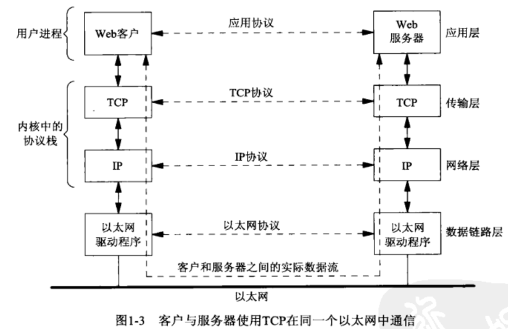
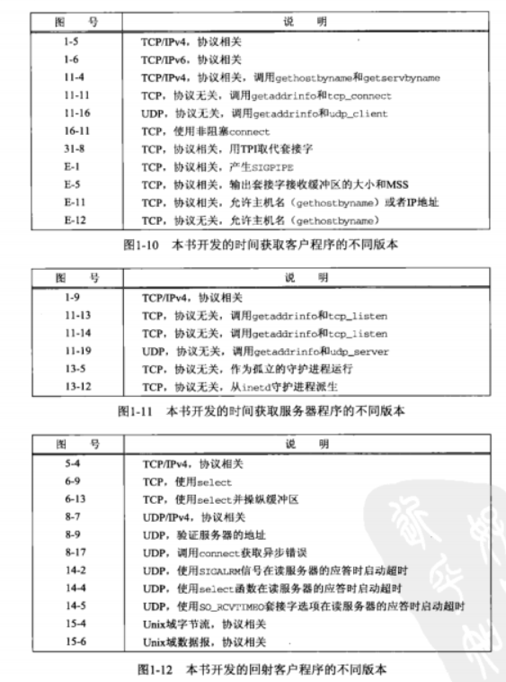
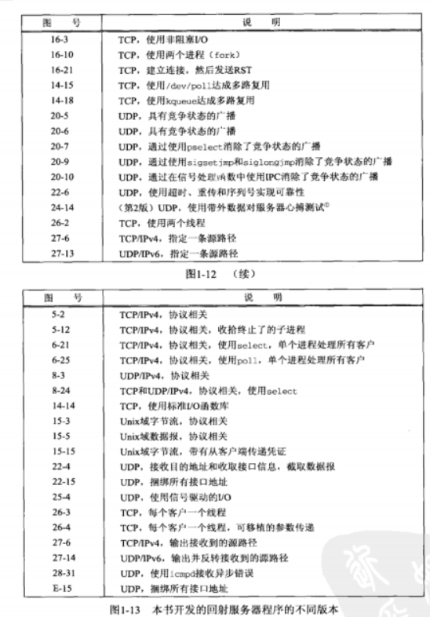

# 简介

## 概述

* 要编写通过计算机网络通信的程序，首先要确定程序互相通信所有的协议(protocol). 
  * 在深入涉及一个协议的细节之前，应该从高层决断通信由哪个程序发起以及响应在何时产生
  * 如web服务程序是一个长时间运行的程序(守护程序)，只在响应来自网络的请求时才发送网络消息。
    * 协议的另一端是一个web客户端程序，与服务器进程的通信总是由客户端进程发起。
  * 一般由客户发起请求能够简化协议
* 但是存在一些较为复杂的网络应用采取异步回调通信，也就是由服务器想客户端发起请求消息。
* 客户端与服务端之间是通过某个网络协议进行通信的，通常涉及多个网络协议层，例如Web客户端和服务端连接
* tcp ip图解
  * 

* 同一个网络应用对的客户端和服务器无需处于同一个局域网(local area network)，局域网间通过路由器(route)连接到广域网(wide area network, WAN).

## 简单的时间获取客户端

* 源码分析

  ```c
  #include    <stdio.h>
  #include	<stdarg.h>		/* ANSI C header file */
  #include	<syslog.h>		/* for syslog() */
  #include     "../lib/unp.h"
  
  
  int		daemon_proc;		/* set nonzero by daemon_init() */
  
  // __VA_ARGS__
  
  #define LOG_QUIT(fmt, ...) err_quit("file: [%s], line: [%d]  " fmt, __FILE__, __LINE__, ##__VA_ARGS__)
  #define LOG_SYS(fmt, ...) err_sys("file: [%s], line: [%d]  " fmt, __FILE__, __LINE__, ##__VA_ARGS__)
  
  int main(int argc, char ** argv) {
      int sockfd, n;
      char recvline[MAXLINE + 1];
      struct sockaddr_in servaddr;
  
      LOG_QUIT("Hello");
  
      if (argc != 2 )
          LOG_QUIT("usage: exec <ip address>, now param num is %d. ", argc - 1);
  
      if ((sockfd = socket(AF_INET, SOCK_STREAM, 0)) < 0)
          LOG_SYS("socket error");
  
      bzero(&servaddr, sizeof(servaddr));
  
      servaddr.sin_family = AF_INET;
      servaddr.sin_port = htons(44);
  
      if (inet_pton(AF_INET, argv[1], &servaddr.sin_addr) <= 0) {
          LOG_QUIT("inet_pton error for %s", argv[1]);
      }
  
      if (connect(sockfd, (SA *) &servaddr, sizeof(servaddr)) < 0)
          LOG_SYS("connect error %d", ntohs(servaddr.sin_port));
  
      while (( n = read(sockfd, recvline, MAXLINE)) > 0 ) {
          recvline[n] = 0;                /* null terminate */
          if (fputs(recvline, stdout) == EOF)
              LOG_SYS("fputs error");
      }
  
      if (n < 0)
          LOG_SYS("read error");
  
      exit(0);
  }
  ```

  * 头文件
    * unp.h
  * 命令行参数
    * 命令行参数
  * 创建TCP套接字 
    * `if ( 	(sockfd = socket(AF_INET, SOCK_STREAM, 0)) < 0 )`
    * socket函数创建一个网际(AF_INET)字节流(SOCK_STREAM)套接字， 他是TCP套接字的别名，会返回一个小整数描述符
    * 随后的操作如connect, read就使用该描述符表示socket
      * tcp套接字 -> (TCP endpoint)
  * 指定服务器的IP地址和端口
    * 把服务器ip地址和端口填入一个网际套接字地址结构(一个sockaddr_in)结构
      * 使用bzero清空结构
      * 地址族 `AF_INET`
      * ``端口号， htons (主机到网络短整数)
      * `ip地址`：`inet_pton`: 支持IPV6， 把点分十进制转换为数值
  * 建立与服务器连接
    * connect函数应用于一个TCP套接字时，将与由他的第二个参数指向的套接字地址结构指定的服务器建立连接
      * 该套接字地址结构的长度必须作为该函数的第三个参数指定。
      * SA 为 `struct sockaddr` 通用套接字地址结构： `每当一个套接字函数需要一个指向某个套接字地址结构的指针的时候，这个指针必需强制转换类型为一个指向通用套接字地址结构的指针`
  * 读入并输出服务器的应答
    * 使用read读取服务器应答，并使用fputs输出结果。(注意 TCP是一个没有记录边界的字节流协议)
      * 不能保证一次读取所用数据。
      * 所以读取一般位于一个循环之中，当read返回0(连接关闭)或负值(发生错误),终止
  * 终止程序
    * exit退出程序，unix退出程序会关闭进程打开的所有描述符。

## 协议无关性

* 上图的程序是与ipv4协议相关的，我们分配并且初始化一个`sockaddr_in`类型的结构，把该结构协议族成员设置为`AF_INET`, 并且指定socket函数第一个参数为`AF_INET`

* 我们转换一个ipv6能够访问的协议

  ```c
  //
  // Created by lcwspr on 2021/9/25.
  //
  
  #include <stdio.h>
  #include "../lib/unp.h"
  #include <sys/socket.h>
  #include <netinet/in.h>
  #include <arpa/inet.h>
  #include <errno.h>
  
  int main() {
  
      int sockfd;
      // 1. create socket
      if( (sockfd = socket(AF_INET6,SOCK_STREAM , 0)) < 0 ) {
          printf("create socket error");
      }
  
      // 2. create server addr
      struct sockaddr_in6 sockaddr;
      bzero(&sockaddr, sizeof(sockaddr));
  
      sockaddr.sin6_family = AF_INET6;
      sockaddr.sin6_port = htons(13);
      if ( inet_pton(AF_INET6, "fd15:4ba5:5a2b:1008:20c:29ff:fe88:22a3", &sockaddr.sin6_addr) < 0 ) {
          printf("parse error");
      }
  
      // 3. connect to server
      if( connect(sockfd, (struct sockaddr *)&sockaddr, sizeof(sockaddr)) < 0 ) {
          printf("connect error %s", strerror(errno));
      }
  
      // 4. read
      char buf[MAXLINE + 1];
      int flag;
      while ( (flag = read(sockfd, buf, MAXLINE) ) > 0) {
          buf[flag] = 0;
          if ( fputs(buf, stdout) == EOF ) {
              printf("output error");
          }
      }
  
      if (flag < 0) {
          printf("read error");
      }
  
      close(sockfd);
  }
  ```

## 错误包裹函数

* 用于检查系统函数调用是否返回错误，`socket`, `inet_pton`, `connect`, `read`, `fputs`函数是否返回错误。

  ```c
  int
  Socket(int family, int type, int protocol) 
  {
      int n;
      if ((n = socket(family, type, protocol)) < 0) 
          err_sys ("socket error");
      
      return n;
  }
  ```

## unix errno 值

* 只要一个unix函数中有错误发生，全局变量errno就被设置位一个指明该错误类型的正值，函数本身通常会返回-1

## 全书程序统计表

* 

* 

## 网络拓扑发现

* `netstat`
  * `-in`: 接口信息，不dns解析
  * `-nr`: 展示路由表
* `ifconfig`

## unix标准

* POSIX 标准。

## 64位体系结构

