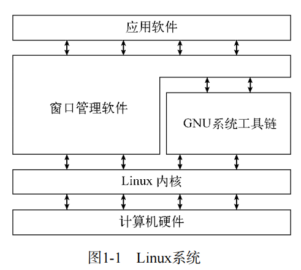

[TOC]

# 初识linux shell

## 什么是Linux

1. Linux可以划分为以下四个部分
   1. Linux内核
   2. GNU工具
   3. 图形化桌面环境
   4. 应用软件
2. 图解
   * 
3. 深入探究Linux内核
   1. Linux系统的核心是内核，内核控制着计算机系统上所有的硬件和软件，在必要时分配硬件，并且根据需要执行相关软件。
   2. linus和Linux内核相关
   3. 内核主要负责四种功能
      1. 系统内存管理
      2. 软件程序管理
      3. 硬件设备管理
      4. 文件系统管理
   4. 核心功能详解
      1. 系统内存管理
         * 操作系统内核的主要功能之一就是内存管理，内核不仅仅管理服务器上面可用的物理内存，还可以创建和管理虚拟内存(通过硬盘虚拟内存 -- 交换空间) 
         * 内存存储单元按组划分成很多块，这些块称做页面(page). 内核将每个内存页面放在物理内存或者交换空间。然后内核会维护一个内存页面表，指明哪些页面位于物理内存内，哪些页面被换到了磁盘上
         * 内核会记录哪些内存页面正在使用，并自动把一段事件未访问的内存页面复制到交换空间区域(称之为换出，swapping out) - 即使还有可用内存. 当程序要访问一个已经被换出内存的页面，内核会先从物理内存换出一个页面，让出空间，然后从交换空间换入请求的内存页面。
      2. 软件程序管理
         1. Linux操作系统将运行中的程序称之为进程。进程可以在前台运行，将输出显示在屏幕上，也可以在后台运行，隐藏到幕后。内核控制着Linux系统如何管理运行在系统上的所有进程。
         2. 内核创建了第一个进程(init进程)来启动系统上的所有其他进程。当内核启动时，他会将init进程加载到虚拟内存中，内核在启动任何其他进程时，都会在虚拟内存中给新进程给分配一块专有区域来存储该进程用到的数据和代码。
      3. 硬件设备管理
         1. 内核的另一个重要职是管理硬件设备。任何Linux系统需要与之通信的设备，都需要在内核代码中加入驱动程序代码。驱动程序代码相当于应用程序和硬件设备的中间人，允许内核与设备之间交换数据，在Linux内核中有两种方法用于插入设备驱动代码
            1. 编译进内核的设备驱动代码
            2. 可插入内核的设备驱动模块
         2. 之前，插入设备驱动代码的唯一途径就是重新编译内核。之后开发了一种更好的将驱动代码插入运行中的内核的方法
            * 开发人员提出了内核模块的概念，允许将驱动代码插入到运行中的内核，无需重新编译内核。当设备不使用也可以将内核模块从内核中移走。
            * Linux系统将硬件设备当成特殊的文件，称之为设备文件
              1. 字符型设备文件： 处理数据时每次只能处理一个字符的设备。大多数类型的调制解调器和终端都是作为字符型设备文件创建的
              2. 块设备文件： 块设备文件时值处理数据时每次能够处理大块数据的设备，比如硬盘
              3. 网络设备文件： 指采用数据包发送和接受数据的设备，包括各种网卡和一个特殊的回环设备
                 * linux为系统上的每个设备都创建一种称为节点的特殊文件，与设备的所有通信都通过设备节点完成，每个节点都有唯一的数值对供Linux内核标识他
                 * 数值对抱愧一个主设备号和一个次设备号，类似的设备被划分到同样的主设备号下，次设备号用于标识主设备组下的某个特定设备 
      4. 文件系统管理
         * Linux内核支持通过不同类型的文件系统从硬盘读写数据，除了自带的文件系统，还支持从许多其他文件系统读取数据
         * Linux内核采用虚拟文件系统(Virtual File System, VFS)作为和每个文件系统交互的接口。这为Linux内核同任何类型的文件系统通信提供了一个标准接口。

## GNU工具

1. 简介
   1. 除了由内核控制硬件设备外，操作系统还需要工具来执行一些标准功能，比如控制文件和程序，Linux在创建linus的时候并没有可用的系统工具，但是在互联网另一头，有一群人正在模仿unix操作系统开发一系列标准的计算机系统工具
   2. (GNU组织)开发了一套完整的Unix工具，但没有可以运行的内核系统，这些工具在名为开源软件(open source software, OSS)理念下开发。
   3. 开软软件理念允许程序源开发软件，并将其免费发布，将Linus的linus内核和GNU操作系统工具整合就产生了一套功能完善的免费操作系统。这就是为何Linux称之为GNU/Linux
2. 核心GNU工具
   1. GNU项目的主旨在于为unix系统管理员设计出一套类似unix的环境。这个目标促使项目移植了很多常见的unix系统命令行工具。供Linux系统使用的这组核心工具被称为coreutils
   2. GNU coreutils软件包由三部分构成
      1. 用于处理文件的工具
      2. 用于操作文本的工具
      3. 用于管理进程的工具
   3. shell
      1. GNU/Linux shell是一种特殊的交互式工具，为用户提供了启动程序，管理文件系统中的文件以及运行在Linux系统上的进程的途径。shell的核心是命令行提示符(负责交互的部分，允许输入文本命令，解释命令，执行)。
      2. shell包含了一组内部命令，用这些命令可以完成诸如复制文件，移动文件，重命名文件，显示和终止系统中正在运行的程序等操作。
      3. 也可以将多个shell命令放入文件中执行，被称为shell脚本，在命令行上执行的任何命令都可以放入shell脚本中作为一组命令执行。

## Linux桌面环境

1. 在早期Linux能用的只有一个简单的Linux操作系统文本界面，这个文本界面允许系统管理员运行程序，控制程序的执行，以及在系统中移动文件。而Microsoft Windows普及之后，用户不再满足对于
   1. X Window系统
      1. 有两个基本要素决定了视频环境： 显卡和显示器。
         * 要在电脑上显示画面，Linux就要知道这两者如何互通，X Windows软件是图形显示的核心部分
         * X Windows软件是直接和PC上的显卡和显示器打交道的底层程序，控制着Linux程序如何在电脑上显示出漂亮的窗口和图形。
      2. 在Linux世界中，Linux并非唯一使用X Windows的操作系统，有针对不同系统的版本，而在Linux世界中能够实现X Windows的软件包不止一种.
         * 最流行的是`X.org`
   2. KDE桌面
      * KDE(K Desktop Environment)  于1996年作为开源项目发布. 会生成一个类似Microsoft Windows的图形化桌面环境.
   3. GNOME桌面
      * GNOME(the GNU Network Object Model Environment, GNU网络对象模型)是另一个流行的Linux环境.于1999年发布.是许多发行版本默认桌面
2. Linux发行版本
   1. 我们将完整的Linux系统包称为发行版,有许多不同的Linux发行版来满足各种可能的运算需求.
      * 完整的核心Linux发行版
        * 包含完整的Linux用户软件,提供一站式Linux安装
      * 特殊用途的发行版
        * 提供特定用途的发行版
      * LiveCD测试发行版