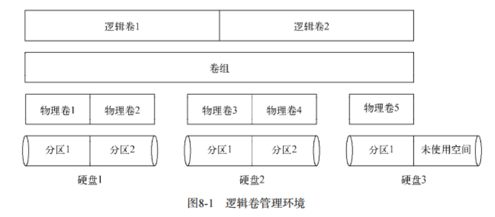

# 文件系统管理

## 基本文件系统概念

## 文件系统操作

1. 创建分区
   * `fdisk /dev/sdb`

## 创建文件系统

1. 创建文件系统
   * `mkfs`
   * `mkfs.ext4`
   * `mkfs.xfs`

## 逻辑卷管理

* 如果用标准分区创建了文件系统，为已经有的文件系统添加额外空间很难办。 Linux逻辑卷管理器(logical volume manager, LVM)可以重新整合文件系统。

### 逻辑卷管理布局

* 逻辑卷管理的核心在于如何处理安装在系统上的硬盘分区。在逻辑卷管理中，硬盘称作物理卷(physical volume, PV). 每个物理卷都会映射到硬盘上特定的物理分区
* 多个物理卷集中在一起可以形成一个卷组(volume group), 逻辑卷管理系统将 卷组视为一个物理磁盘，但是事实上卷组可能是分布在多个物理磁盘上的多个物理分区组成的。卷组提供了一个创建逻辑分区的平台，这些逻辑分区则包含了文件系统
* 整个结构中最后一层是逻辑卷(logical volume, LV). 逻辑卷为Linux提供了创建文件系统的分区，作用类似于Linux中的物理硬盘分区。
* 

### lvm基本使用

1. 定义物理卷
   * 将物理硬盘上的物理分区转换成Linux LVM使用的物理区卷
2. 使用分区创建实际的物理卷，使用pvcreate
   * `sudo pvcreate /dev/sdb1`
   * 查看创建进度
     * `sudo pvdisplay /dev/sdb1`
3. 创建卷组(可以将所有物理卷加到一个卷组，也可以创建多个卷组)
   * `vgcreate`: 需要一些命令行参数来定义卷组名以及用来创建卷组的物理卷名
   * `sudo vgcreate Voll /dev/sdb1`
   * 查看创建的卷组
     * `sudo vgdisplay Voll`
4. 创建逻辑卷
   * Linux系统使用逻辑卷来模拟物理分区，在其中保存文件系统。
   * `lvcreate`命令
     * `sudo lvcreate -l 100%FREE -n lvtest Vol1`
     * `-l`: 白分比， `-L`: 字节，千字节...
5. 创建文件系统
   * `sudo mkfs.ext4 /dev/Voll/lvtest`

6. 管理lvm
   * `vgchange, vgremove, vgextend, vgreduce, lvextend, lvreduce`