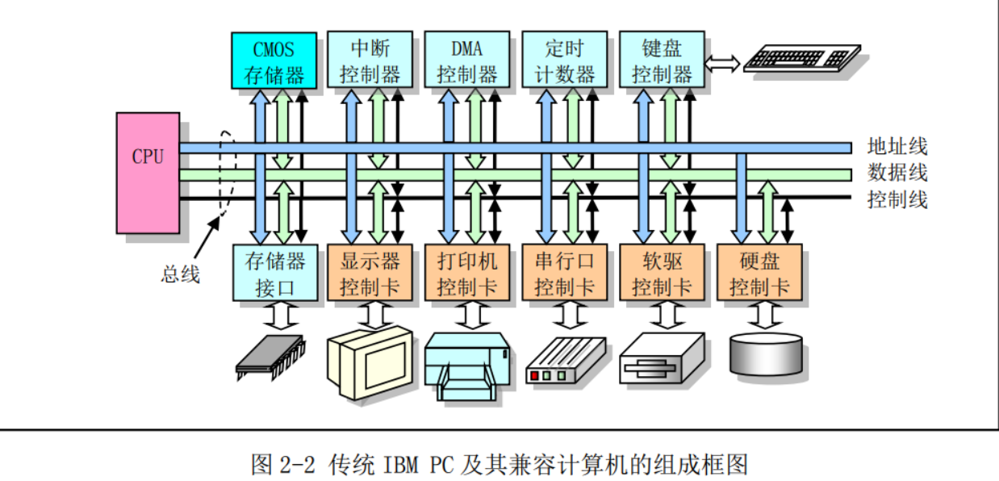
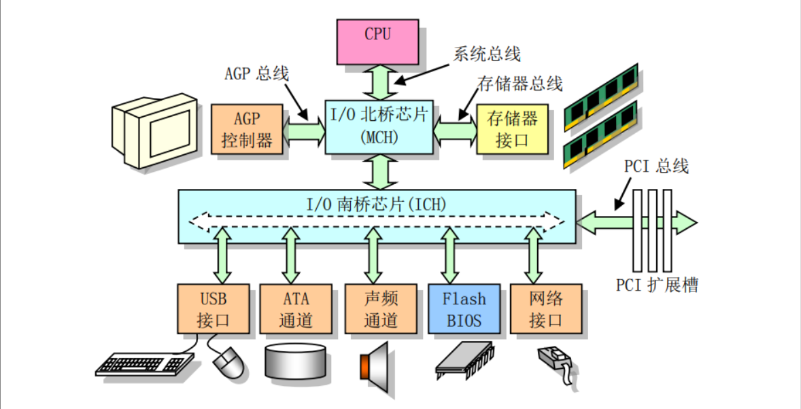
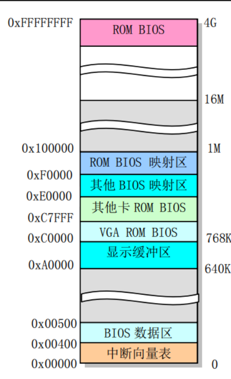
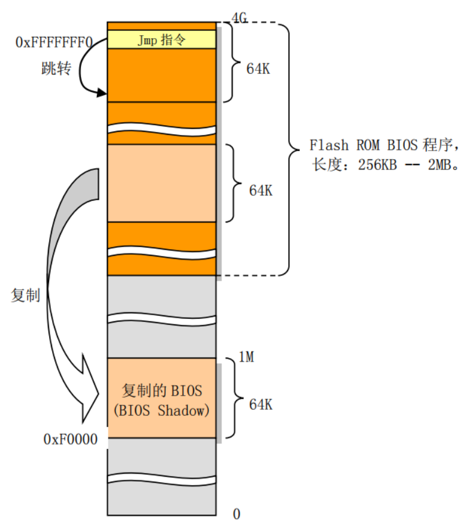
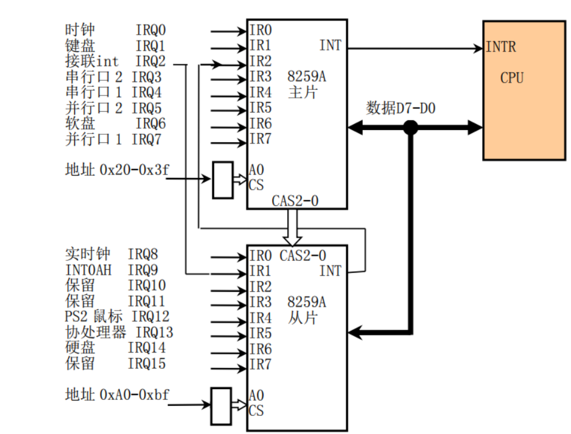

# 微型计算机组成结构

## 基本结构

1. 任何一个系统都可以任务由四个基本部分组成
   1. 输入部分
   2. 处理中心
   3. 输出部分
   4. 能源
2. 计算机系统可以分为软件部分和硬件部分，两者相互依存。
   * 硬件是计算机系统的可见部分，是软件运行和存储的平台
   * 软件是控制硬件操作和指令的指令流。
3. 主要说明基于Intel 80X86中央处理器(cpu)的IBM PC微型计算机及其兼容机的硬件系统
4. 操作系统与其运行的硬件环境密切相关，PC/AT代表具有80386或者以上CPU或的IBM PC及其兼容机

## 微型计算机组成原理

* 传统微型计算机硬件组成结构
  * 

* 如上所示，CPU通过地址线，数据线，控制信号组成线组成了本地总线(或称为内部总线)与系统其他部分进行数据通信
  * 地址线：用于提供内存或I/O设备的地址(指明需要读/写数据的具体位置)
  * 数据线： 用于在CPU和内存或I/O设备之间提供数据传输的通道
  * 控制线： 负责指挥执行的具体读/写操作
* 对于80386来说，其内部地址线和数据线都分别有32根。
* 如图所以，上部控制器和存储器接口通常都集成在计算机主板上，这些控制器分别都是以一块大规模集成电路芯片为主组成的功能电路
  * 如： 中断控制器由Intel 8259A或其他兼容芯片组成
  * 如： DMA控制器通常采用Intel 8237A芯片构成
  * 如： 定时计数器的核心则是Intel 8253/8254定时芯片
  * 如： 键盘控制器使用的是Intel 8042芯片来与键盘中的扫描电路进行通信
* 如图下方，控制卡(或适配器)， 则是通过拓展插槽与主板上系统总线连接
  * 拓展插槽是系统地址总线，数据总线，控制线与拓展设备控制器的标准连接接口。
  * 通常接口有ISA, EISA, PCI, AGP等等，还有例如采用串行通信点对点技术的告诉PCIE总线
* 随着计算机技术的发展，很多需要使用控制卡来完成的功能都已经集成在计算机主板上少数几个超大规模集成电路芯片中。并且为了系统不同部分都能达到最高速率，总线结构也发生了很大变化
  * 现代主板主要使用2个超大规模集成芯片： 南桥芯片和北桥芯片
  * 北桥芯片主要用于与CPU，内存和AGP接口，具有很高的传输速率，北桥芯片还起着存储器控制作用，所以Intel将该芯片标记为MCH(Memory Controller Hub)
  * 南桥用于管理低， 中速的组件，例如PCI 总线，usb端口。所以南桥芯片称为ICH(I/O Controller Hub)
* 南桥北桥
  * 

## I/O端口寻址和访问控制方式

* CPU和I/O适配器之间开始传输数据时，首先需要确定适配器的I/O位置，即端口地址。在CPU和I/O之间传输数据时，可以使用程序循环查询，中断处理和DMA传输方式。

### 端口和寻址

* CPU为了访问I/O接口控制器或控制卡上的数据和状态信息，首先需要指定他们的地址。这种地址就称为I/O端口地址或者简称端口。
* 通常一个I/O控制器包含
  1. 访问数据的数据端口
  2. 输出命令的命令端口
  3. 访问控制器执行状态的状态端口
* 端口地址的设置方法一般有两种
  1. 统一编址
     * 将I/O控制器中的端口地址归入存储器寻址地址空间范围内
     * IBM PC机也也有一部分采用了统一编址，例如CGA显卡上的显存地址就直接占用了存储器空间
  2. 独立编址
     * 将I/O控制器和控制卡的寻址空间单独作为一个独立的地址空间对待，称为独立地址空间(每个端口有一个I/O地址与之对应，并且使用专门的I/O指令来访问端口)
     * IBM PC及其兼容微机主要使用独立编址方式，采用了一个独立的I/O地址空间对控制涉笔中的寄存器进行寻址和访问
     * 使用ISA总线结构的传统PC其IO地址空间是`0x000-3ff`,有1024个端口

### 接口访问控制

1. PC机接口数据传输控制方式一般
   * 可采用程序循环查询方式： CPU通过在程序中循环查询指定设备控制器中的状态来判断是否可以与设备进行数据交互
   * 中断处理方式：需要中断控制器的支持，只有当IO设备通过中断向CPU提出中断请求，CPU才会暂时中断当前任务去执行相应I/O中断处理服务过程，当执行完成中断处理程序，CPU又会继续执行刚才被中断的程序。
     * 在I/O控制器或设备发出中断请求时，CPU通过使用中断向量表来寻址相应中断处理服务过程的入口地址
     * Linux中大多IO设备都是用中断方式
   * DMA(Direct Memory Access)传输方式
     * 用于I/O设备与系统内存之间进行批量数据传送，整个过程使用DMA控制器进行，无需CPU插手

## 主存储器,BIOS和CMOS存储器

* 典型PC机器上通常含有三种类型的存储器，
  1. 用来运行程序和临时保存数据的内存存储器
  2. 用于存放系统开机诊断和初始化硬件程序的ROM
  3. 用来存放计算机实时时钟信息和系统硬件配置信息的少量CMOS存储器

### 主存储

* IBM PC(PC/AT)系统只带有640KB RAM主存储器。由于采用的8088/8086 CPU只有20根地址线，寻址范围最高位1024KB(1MB)
* 如今的计算机，为了与原PC软件兼容，系统1MB以下物理内存分配与原来保持一致，只是原来系统ROM中的基本输入输出程序BIOS一直处于CPU能寻址的内存最高端位置
* 当计算机上电初始化，物理内存设置成从地址0开始的联系区域。除了地址从0xA0000到0xFFFFF(640K到1M共384K)和0xFFFE0000到0xFFFFFFFF(4G处的最后一64K)范围以外的所有内存都可以用作系统内存。这两个特定范围被用作I/O设备和BIOS程序
* 结构图
  * 

### 基本输入/输出程序

* 存放在ROM中的BIOS程序主要用于计算机开机时执行系统各个部分的自检
  * 建立起操作系统需要使用的各种配置表(终端向量表，硬盘参数表)
  * 并把处理器和系统其他部分初始化到一个已知状态
  * 并且还为DOS等操作系统提供硬件设备接口服务。(不具有可重入性，并发运行)
    * 一般只在初始化时利用BIOS提供的系统参数。
* 当计算机上电，CPU会自动把代码段寄存器CS设置为0XF000, IP被设置为0XFFF0.（段基地址被设置为0xFFFF0000)
  * BIOS会在这里存放一条跳转指令`JMP`到BIOS代码中的64KB范围内的某一条指令
  * 由于目前PC/AT微机中BIOS容量大多有1MB到2MB，一般存储在(Flash)中， 为了能够执行BIOS中超过64KB范围，BIOS程序会首先使用32位访问方式把数据段寄存器的访问范围设置为4G
  * 之后，BIOS执行了系列硬件检测和初始化操作之后，就会把与原来PC机兼容的64KB BIOS代码和数据复制到内存低端1M末端的64K，然后跳转到这个地方让CPU真正运行在实地址模式下
  * 最后BIOS就会从硬盘或其他块设备把操作系统引导程序加载到`0x7c00`处
  * 图解
    * 

### CMOS存储器

* PC/AT中，除了使用内存和ROM BIOS外，还是用只有很少存储容量的CMOS(Complementary Metal Oxide Semiconductor)存储器来存放计算机的实时时钟信息和系统硬件配置信息。

## 控制器和控制卡

* 一台PC中包含多种控制卡和控制器，用来传输数据和控制计算机运行。这些控制器和控制卡主要有
  1. 中断控制器
  2. DMA控制器
  3. 键盘控制器
  4. 软盘/硬盘控制卡
  5. 串行通信控制卡
  6. 显示控制卡
* 控制器和控制卡
  * 控制器： 指集成在计算机主板上的控制部件
  * 控制卡：则是指通过拓展槽插入计算机的控制卡部件

### 中断控制器

* IBM PC/AT 80x86兼容微机使用两片级联8259A可编程中断控制芯片组成一个中断控制器，用于实现I/O设备的中断控制数据存取方式，并且能为15个设备提供独立的中断控制功能
* 在计算机刚开机初始化期间，ROM BIOS会对这两片8259A芯片进行初始化，并分别把15级中断优先级分配给时钟定时器，键盘，串行口，打印口，软盘控制，协处理器和硬盘等设备使用
* 同时在内存开始处`0x000-0xfff`区域建立一个中断向量表，并把中断请求映射到`0x08`开始的中断向量号
* 

* 但是由于中断号`0x00--011f`属于intel公司专门保留给cpu使用的，所以BIOS的这些设置与Intel公司的要求有冲突。所以Linux系统不会直接使用BIOS设置的中断号，在上电时，Linux系统会在内核初始化期间对于8259A进行设置

### DMA控制器

* DMA控制器的主要功能是通过让外部设备直接与内存传输数据来增强系统的性能。通常由机器上的intel 8237芯片或其他兼容芯片实现。
  * 通过对DMA控制器进行编程，外设与内存之间的数据传输能在不受CPU控制条件下进行。

### 定时/计数器

* Intel 8253/8254是一个可编程定时/计数器芯片，用于处理计算机中的精确延时。提供了3个独立的16位计数器通道。提供了16位计数器通道。

### 键盘控制器

* 我们使用的键盘是IBM公司与1984年的PC/AT兼容键盘，键盘上有一个键盘编码器的处理器(intel 8048)专门用来扫描收集所有按键按下和松开的状态信息(扫描码)，并发送到主机主板上的键盘控制器中。
  * 当一个键被按下，键盘发送的扫描码称为接通扫描码(Make Code)
  * 当一个键被放开，发哦送码称为断开扫描码(Break Code)
* 主机键盘控制器专门用来对接收到的键盘扫描码进行解码，并把解码后的数据发送到操作系统的键盘数据队列中。因为每个按键接通断开码都是不同的，所以键盘控制器根据扫描码就可以确定用户在操作哪个键。
  * 最常用的扫描码集： 现代键盘默认使用的扫描码集，通常称为AT键盘扫描码集
  * 但是为了与PC/XT机器兼容，主机键盘控制器仍然会把所有接收到的第二套键盘扫描码转换成第一套扫描码。
* 键盘控制器通常采用Intel 8042单片微处理器芯片或其他兼容电路，现在PC机都已经将键盘控制器集成在主板芯片组中，但是功能仍然与使用8042芯片的控制器相兼容。
  * 键盘控制器接受键盘发送来的11位串行格式数据
    * 第一位是起始位，第2-9位是8位键盘扫描码，第10位是奇偶校验位，第11位是停止位。
    * 键盘控制器接收到11位串行数据，就将键盘扫描码转换成PC/XT标准键盘兼容的系统扫描码。然后通过中断控制器IRQ1引脚想CPU发起中断请求。
  * 当某一个键被按下，我们可以从键盘控制器端口接受到一个XT键盘接通码，表示键盘某个位置的键被按下。当断开时，会收到一个断开码(该键接通码+0x80)
  * 对于拓展的AT键盘按键，接通断开码通常有2-4字节，第一个字节一定是`0xE0`
  * 例如左边的ctrl 查看1字节码`0x1D`, 右边的ctrl就会产生2字节`0xE0, 0x1D`

