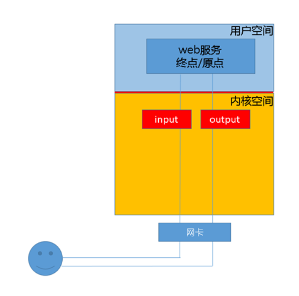
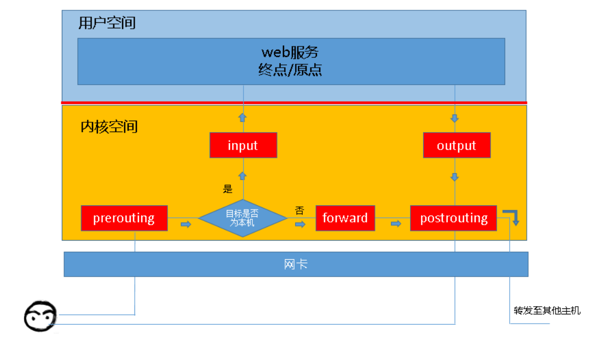
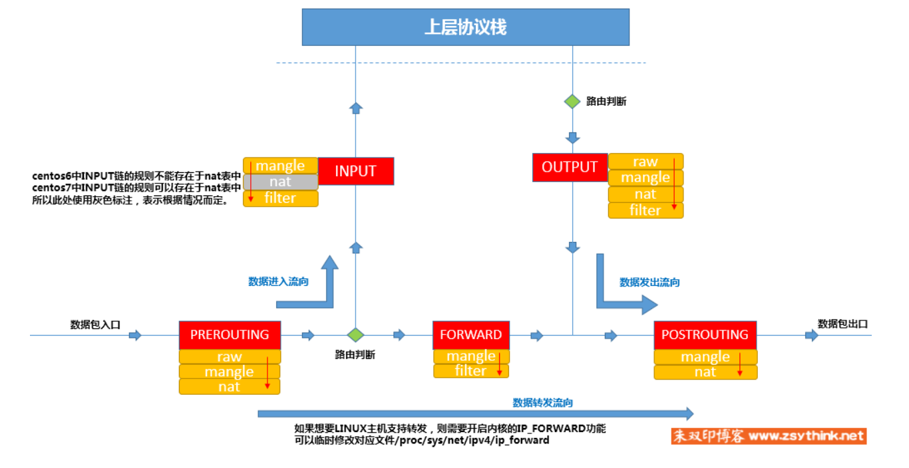

# iptables 基本概念

## 防火墙概念

* 逻辑上来说，防火墙大体可以分为主机防火墙和网络防火墙， 网络防火墙和主机防火墙并不冲突，可以理解为网络防火墙主外(集体)， 主机防火墙主内(个人)
  * 主机防火墙： 针对单个主机进行防护
  * 网络防火墙： 往往处于网络入口或边缘，针对网络入口进行防护，服务与防火墙背后的本地局域网
* 物理上来讲，防火墙分为硬件防火墙和软件防火墙
  * 硬件防火墙： 在硬件级别实现部分防火墙，另一部分功能基于软件实现，性能搞，成本高
  * 软件防火墙： 应用软件处理逻辑，运行于通用硬件平台之上的防火墙，性能低，成本高

## iptables 简介

* iptables 其实不是真正的防火墙，可以理解为一个客户端代理，用户通过iptables这个代理，将用户的安全设定执行到对应的安全框架中，这个框架才是真正的防火墙，叫做netfilter
* netfilter才是防火墙真正的安全框架(framework), netfilter位于内核空间。iptables其实是一个命令行工具，位于用户空间，我们使用这个工具操作真正的框架
* netfilter/iptables组成linux平台下的包过滤防火墙，与大多数Linux软件一样，可以完成封包过滤，封包重定向和网络地址转换(NAT)等功能。
  * 网络地址转换(Network Address Translate)
  * 数据包内容修改
  * 数据包过滤等

## iptables 作用

1. 作用
   * iptables是按照规则来办事的，规则(rules)其实就是网络管理员预定义的条件，规则一般的定义为： `如果数据包头符合这样的条件，就这样处理数据包`
   * 规则存储在内核空间的信息包过滤表中，这些规则分别指定了 源地址，目的地址，传输协议(如 TCP, UDP, ICMP) 和 服务类型 (HTTP, FTP, SMTP).
   * 当数据包与规则匹配时， iptables就根据规则所定义的方法来处理这些数据包， 如放行(accept), 拒绝(reject)， 和丢弃(drop), 配置防火墙主要工作就是添加，修改和删除这些规则
2. 解析
   * 当客户端访问服务器的Web服务时，客户端发送报文到网卡，而tcp/ip协议栈是属于内核的一部分，所以客户端的信息会通过内核TCP协议传输到用户空间中的web服务中，而此时客户端报文的目标终点为web服务所监听的套接字(port)上，当web服务需要响应客户端请求时，web服务发出的响应报文的目标终点则为客户端，这个时候,web服务所监听的ip与端口反而变成了原点
   * netfilter才是真正的防火墙，他是内核的一部分，所以，如果我们想要防火墙能够达到防火的目的，则需要在内核中设置关卡，所有进出的报文都要通过这些关卡，经过检查之后，符合条件的才能放行，符合阻拦条件的需要被阻拦，于是出现了input关卡和output关卡，不过这些在iptables中称之为链。
   * 
   * 上述的场景并不完善，因为客户端发来的报文访问的目标地址可能并不是本机，而是其他服务器，当本机的内置支持`IP_FORWARD`， 我们可以将报文转发给其他服务器，这时就会提到iptables中的其他链，他们是路由前(PREROUTING), 转发(FORWARD), 路由后(POSTROUTING)
   * 也就是，我们启用了防火墙功能的时候，报文需要经过如下关卡，也就是说，根据实际情况的不同，报文经过"链"可能不同。如果报文需要转发，那么报文则不会经过input链发往用户空间，而是直接在内核空间中经过forward链和postrouting链转发出去的。
   * 
3. 常见报文流向
   1. 到本机某进程的报文： PREROUTING -> INPUT
   2. 由本机转发的报文：PREROUTING -> FORWARD -> POSTROUTING
   3. 由本机的某进程发出的报文(通常为响应) ： OUTPUT -> POSTROUTING

## 链的概念

* 为什么这些关卡在iptables中会被称为链？ 
  * 防火墙的作用就在于对经过的报文匹配规则，然后执行对应的动作，所以当报文经过这些关卡的时候，必须匹配这个关卡上的规则
  * 但是一个关卡上面可能有很多条规则，我们把这些规则串到一个链条上就形成了一个链
  * 每个经过关卡的报文，都需要将这条链上的所有规则匹配一遍，如果有符合条件的规则，则执行对应的动作

## 表的概念

* 我们在每个链上都放置了一串规则，但是这些规则有些相似
  * 比如A类规则都是对ip或者端口的过滤
  * B类规则都是修改报文
  * 那么我们是不是能把实现相同功能的规则放在一起
* 我们把具有相同功能的规则的集合叫做表，所以说，不同功能的规则，我们可以放置在不同的表中进行管理，而iptables已经为我们定义了4种表每种表对应了不同的功能，我们定义的规则都逃离不了这四种功能的范围，所以必须搞明白每种表的作用
  1. filter表，负责过滤功能，防火墙， 内核模块(iptable_filter)
  2. nat表， network address translation, 网络地址转换，内核模块(iptable_nat)
  3. mangle表， 拆解报文，做出修改，重新封装，iptable_mangle
  4. raw表， 关闭nat表上启用的连接追踪机制，iptable_raw

## 表和链的关系

* 注意： 某些链中注定不会包含某类规则，就像某些关卡天生就不具备某些功能一样，我们需要明确每个链上的规则都存在于哪些表中
* 先来看看prerouting 链上面的规则都存在于哪些表中
  * prerouting (prerouting 链上的规则只能放在如下的表中)
    * nat
    * raw
    * mangle
* 每个链所拥有的功能
  * PREROUTING: raw表， mangle表, nat表
  * INPUT: mangle表, filter表， (centos7还有nat表)
  * FORWARD: mangle表, filter表
  * OUTPUT: raw表, mangle表, nat表, filter表
  * POSTROUTING： mangle, nat表
* 我们在实际使用中，会以表的概念来实际使用iptables, 以表为操作入口，对规则进行定义
  * raw表中，可以被那些链使用
    * PREROUTING
    * OUTPUT
  * mangle表
    * PREROUTING
    * INPUT
    * FORWARD
    * OUTPUT
    * POSTROUTING
  * nat表
    * PREROUTING
    * OUTPUT
    * POSTROUTING
    * INPUT(centos7)
  * filter
    * INPUT
    * FORWARD
    * OUTPUT
* 数据包经过一个链的时候，会将当前链的所有规则都匹配一遍，但是匹配时总归要有顺序，我们应该一条一条匹配。而且相同功能类型的规则会汇聚在一张表中，哪些表的规则会放在链的最前面执行，这里有一个优先级的问题
  * 例如 PREROUTING链的规则存放于三张表重，这三张表的执行优先级如下所示
    1. raw
    2. mangle
    3. nat
  * iptables 为我们定义了4张表，他们处于同一条链，执行优先级如下
    1. raw
    2. mangle
    3. nat
    4. filter
* 为了更加方便的管理，我们还可以在某个表里面自定义链，将针对于某个应用程序所设置的规则放置在这个自定义链中，但是自定义链不能直接使用，只能没某个默认的链当作动作去调用才能起作用。

## 数据经过防火墙的流程

* 我们可以将数据包通过防火墙的流程总结如下
  * 

## 规则的概念

* 规则
  * 根据指定的匹配条件来尝试匹配每个流经此处的报文，一旦匹配成功，则由规则后面指定的处理动作进程处理

## 匹配条件

* 匹配条件分为基本匹配条件 和 拓展匹配条件
* 基本匹配条件
  * 源地址： Source IP
  * 目标地址: Destination IP
* 拓展匹配条件
  * 源端口 : Source Port
  * 目标端口: Destination Port

## 处理动作

* 处理动作在iptables被称为target(不准确)， 动作也可以分为基本和拓展
* 常用动作
  * ACCEPT: 允许数据包通过。
  * DROP: 直接丢弃数据包，不给任何回应信息，这时候客户端会感觉自己的请求泥牛入海了，过了超时时间才会有反应。
  * REJECT: 拒绝数据包通过，必要时会给数据发送端一个响应的信息，客户端刚请求就会收到拒绝的信息。
  * SNAT： 源地址转换，解决内网用户用同一个公网地址上网的问题。
  * MASQUERADE: 是SNAT的一种特殊形式，适用于动态的、临时会变的ip上。
  * DNAT: 目标地址转换。
  * REAIRECT: 在本机做端口映射。
  * LOG: 在/var/log/messages文件中记录日志信息，然后将数据包传递给下一条规则，也就是说除了记录以外不对数据包做任何其他操作，仍然让下一条规则去匹配。