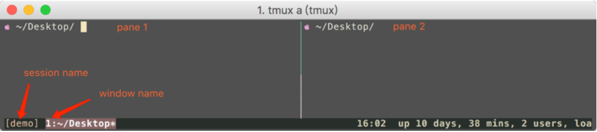

# tmux

## tmux简介

1. 丝滑分屏： tmux窗口中，新开的窗口，默认进入到之前的路径，如果是ssh连接，登录状态也保持一直，
2. 保护现场： 即使命令行的工作只进行到一半，关闭终端后依旧可以重新进入操作现场。继续工作
3. 会话共享: (适用于远程编程或者远程教学)， 将tmux会话的地址分享给他人，就可以通过SSH接入该会话。

## 基本概念

1. tmux采用了C/S模型构建，输入tmux命令就相当于开启了一个服务器，此时默认将建立一个会话，然后会话中默认新建一个窗口，窗口中默认新建一个面板
2. 会话，窗口，面板之间的联系如下所示：
   * 一个tmux session(会话)可以包含多个window(窗口)， 窗口默认充满会话界面，所以这些窗口可以运行相关性不大的任务
   * 一个window又可以包含多个pane(面板)， 窗口下的面板，都处于同一个界面下，这些界面适合运行相关性较高的任务，以便于同时观察到他们的运行情况
   * 图解
     * 

## 会话

### 新建会话

* 新建一个tmux session非常简单，语法为`tmux new -s session-name`, 也可以简写为`tmux`
  * `tmux`: 创建无名会话
  * `tmux new -s demo`: 新建一个名为demo的会话
* 断开当前会话
  * `tmux detach`
  * `ctrl b + d`
* 进入之前会话
  * `tmux attach-session -t session-name`
  * `tmux a -t demo`
* 关闭会话
  * `tmux kill-server`
  * `tmux kill-session -t session-name`
* 查看所有的会话
  * `tmux list-session`
  * `tmux ls`
  * `ctrl+b s`

## 常用快捷键

### 系统级别

1. `ctrl + b ?`: 显示快捷键帮助
2. `ctrl + b d`： 断开当前会话
3. `ctrl + b D`: 选择要断开的会话
4. `ctrl + b ctrl + z`: 挂起当前会话
5. `ctrl + b r`: 强制重载当前会话
6. `ctrl + b s`: 显示会话列表用于切换
7. `ctrl + b :`: 进入命令行模式
8. `ctrl + b ]: 进入复制模式`
9. `ctrl + b ]`: 粘贴复制模式中的文本

### 窗口级别

1. `ctrl + b c`: 新建窗口
2. `ctrl + b &`: 关闭当前窗口
3. `ctrl + b 0~9`: 切换到指定窗口
4. `ctrl + b p`: 切换到上一窗口
5. `ctrl + b n`: 切换到上一个窗口
6. `ctrl + b w`: 打开窗口列表，用于切换窗口
7. `ctrl + b ,`: 重命名当前窗口
8. `ctrl + b .`: 修改当前窗口编号
9. `ctrl + b f`: 快速定位到窗口

### 面板操作

1. `ctrl + b "`: 当前面板上下一分为二，下侧新建面板
2. `ctrl + b %`: 左右新建面板，右侧为新建
3. `ctrl + b x`: 关闭当前面板
4. `ctrl + b z`: 最大化当前面板，重复恢复
5. `ctrl + b !`: 将当前面板移动到新的窗口打开
6. `ctrl + b ;`: 切换到最后一次使用的面板
7. `ctrl + b q`: 显示面板编号
8. `ctrl + b {`： 向前置换当前面板
9. `ctrl + b }`: 向后置换面板
10. `ctrl + b 方向键` :切换面板
11. `ctrl + b o`: 选择下一面板
12. `ctrl + b t`: 显示时钟 